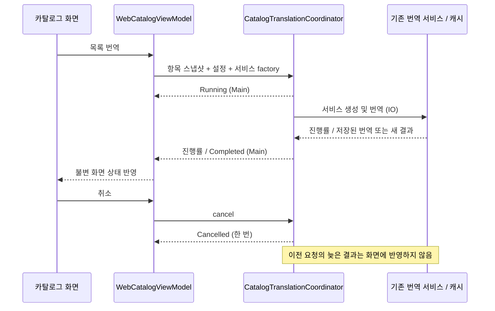

# 앱 전용 작업 인계 — 카탈로그 기능 분리 1차

## 작업 격리

- 기준: PR #5의 `b9604fb`
- 브랜치: `codex/catalog-feature-coordinators`
- worktree: `/Users/teddy.bear/workspace/PageTurner/.worktrees/app-coordinators`
- 수정 범위: 이 worktree의 `app/`만. `server/`, `core-*`, 루트 Gradle 변경 없음.
- 원래 `/Users/teddy.bear/workspace/PageTurner`의 백엔드 체크아웃은 전환하지 않음.
- 로컬 `.env`와 비밀 키는 worktree로 복사하지 않음.

## 이번 범위

기존 `docs/CORE_PAGING_REFACTOR_PLAN.md` 3단계의 목록 번역, 표지 저장소,
오프라인 다운로드 코디네이터를 분리합니다. 카탈로그 필드 변환/분할 로직은
별도 공용 커밋 `c3c786b`를 반영하여 `core-translation` 구현을 호출합니다.



ViewModel은 화면 상태 반영과 Android 서비스 factory 연결만 담당합니다.
코디네이터는 앱 작업의 수명주기를 담당합니다. 공용 필드 요청/결과/진행률은 typealias로
연결하고, 목록 변환과 분할 계산은 공용 코어를 호출합니다. 서버 공용 변경을 앱 PR에
복사하지 않습니다. 기존 번역 서비스의 캐시 키·저장 형식·공급자 호출 규칙도 유지합니다.

표지 저장소는 요청 중복 제거, 2 MiB 이미지 제한, 총 8 MiB / 32개 LRU 캐시,
취소 전파와 부분 실패 처리를 담당합니다. 한 요청에서 최대 32개 URL만 처리합니다.
화면 상태에는 현재 요청의 이미지 결과만 보관해 페이지 이동마다 계속 누적하지 않습니다.

오프라인 다운로드는 기존 다운로더/저장소를 사용하면서 Main 디스패처 상태 전달,
진행률 conflation, 취소/실패/완료 구분과 이전 작업의 늦은 콜백 차단을 담당합니다.

## 변경 이유와 확인 범위

- 기존에는 번역 서비스 생성이 예외 처리 밖에 있어 초기화 실패 시 로딩 상태가 남을 수 있었음.
- 기존 취소 작업의 종료 처리가 다음 작업의 busy/진행률을 지울 수 있었음.
- generation 식별과 취소 전파로 이전 작업의 결과·종료 상태가 새 작업을 덮지 않게 함.
- 번역 서비스 생성과 번역 호출은 IO, 상태 콜백은 호출자 디스패처(Main)로 분리.
- 목록 번역 API를 그대로 사용하며 화면 레이아웃은 변경하지 않음.

단위 테스트는 성공/진행률, factory 실패, 공급자 실패 후 재시도, 중복 취소,
취소를 늦게 처리하는 공급자와 새 요청의 경합, 빈 목록/미설정, 항목 스냅샷 및 진행률
범위를 검사합니다. 테스트 공급자를 사용하며 외부 LLM 실호출 성공을 뜻하지 않습니다.

Android instrumentation 테스트는 실제 Main/IO 디스패처를 검사합니다.
테스트 번역 문자열을 사용하며 실제 서비스 번역이나 E-Ink 성능 벤치마크가 아닙니다.

## 실행

이 worktree를 작업 폴더로 지정하고 다음 명령을 실행합니다.

```bash
./gradlew -PbuildTarget=app verifyModuleBoundaries :app:testDebugUnitTest :app:lintDebug :app:assembleDebug :app:assembleDebugAndroidTest
```

Android SDK는 `ANDROID_HOME` 또는 이 worktree의 `local.properties`로 설정합니다.
앱 폴더는 Gradle 서브모듈이므로 빌드 명령은 worktree 루트의 `gradlew`를 사용합니다.

실기기 테스트는 설치 승인 후 아래 클래스로 제한합니다. 앱 데이터 초기화와 삭제는 하지 않습니다.

```bash
./gradlew -PbuildTarget=app :app:connectedDebugAndroidTest -Pandroid.testInstrumentationRunnerArguments.class=com.dongholab.pagetuner.source.CatalogTranslationCoordinatorInstrumentedTest
```

## 검증 결과 (2026-09-05)

- 앱 단위 테스트: 231개 중 218개 통과, 13개 건너뜀, 실패 0.
- 신규 coordinator/repository JVM 테스트: 14개 통과.
- 모듈 경계 검사, Lint, debug APK, instrumentation APK 빌드 성공.
- 실제 ADB 기기 연결은 확인했으나 덮어설치 승인 대기: instrumentation 실행은 미완료.
- 외부 번역 API 호출, DB 저장, E-Ink 프레임 벤치마크는 이번 테스트에 포함하지 않음.

다음 앱 단계는 영속 페이지 캐시와 제한된 다음 페이지 선행 로딩입니다.
