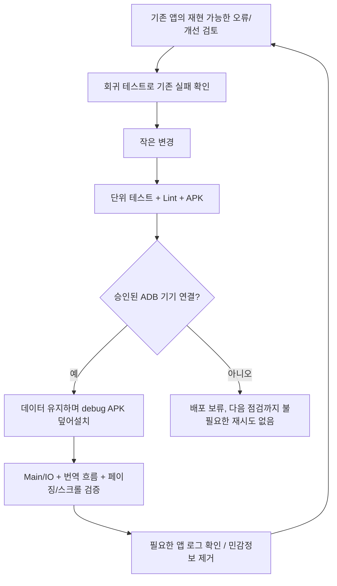
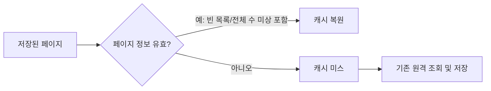
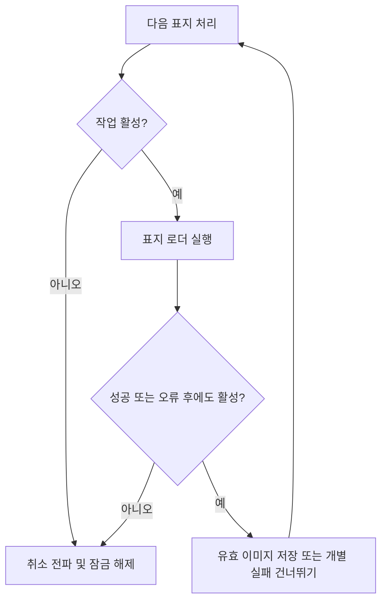

# 로컬 배포·검증·개선 루프

작업 폴더: `/Users/teddy.bear/workspace/PageTurner/.worktrees/app-coordinators`
현재 단계 브랜치: `codex/app-local-validation-loop` (PR #8 기준).
백엔드 worktree, `server/`, 루트 빌드 및 공용 코어는 이 변경에서 수정하지 않습니다.

사용자가 승인한 범위는 앱 디버그 빌드의 로컬 설치, 기존 기능의 검증 및 작은 개선 반복입니다.
데이터 초기화·앱 삭제·비밀 키 복사, 새로운 유료 호출이나 의미 있는 기능 확장은 포함하지 않습니다.

## 2026-09-05 첫 반복

### 재현 및 수정

카탈로그 서비스의 16개 공유 잠금은 서로 다른 페이지의 캐시 키가 같은 슬롯에 해당하면
두 요청을 직렬화했습니다. 느린 선행 로딩이 현재 페이지까지 지연시킬 수 있는 구조였습니다.

충돌하는 서로 다른 페이지 두 개를 찾아 동시에 호출하는 회귀 테스트를 추가했습니다.
두 fixture 공급자가 모두 시작해야 통과하는 검사입니다.

- 기존 구현으로 실행: `TimeoutCancellationException: Timed out waiting for 2000 ms`, 1개 실패.
- 개선 구현: 페이지 키별 잠금으로 변경, 마지막 실행/대기 사용자가 끝나면 잠금 항목 제거.
- 수정 후 동일 테스트 및 전체 앱 검증 통과. 같은 페이지 요청 중복 방지 회귀도 유지.
- 앱 단위 테스트 246개 중 232개 통과·14개 건너뜀·실패 0. 모듈 경계 검사,
  Lint, debug APK 및 instrumentation APK 빌드 성공.

타임아웃 값은 테스트의 동시성 검사 제한이며 실제 기기에서 측정한 사용자 지연값이 아닙니다.
fixture 테스트를 실제 HTTP/LLM/기기 성능 결과로 표시하지 않습니다.

### 배포 상태

이번 반복의 ADB 확인 두 번 모두 `List of devices attached` 아래가 비어 있었습니다.
따라서 APK 설치·instrumentation·실제 앱 화면/프레임 측정은 실행하지 않았습니다.
이전의 덮어설치 승인 대기는 해소되었고, 현재 제약은 기기 미연결입니다.

승인된 기기 식별자: `R3CXB0KNSDL`. 연결이 돌아오면 먼저 기기와 패키지를 확인하고
검증한 APK를 데이터 초기화 없이 설치합니다. 다른 연결 기기에 임의로 설치하지 않습니다.

앱 범위 개선과 기기 연결 확인은 이 대화의 30분 간격 heartbeat로 이어집니다.
상태가 동일하면 알리지 않고 의미 있는 결과·새 실패·사용자 결정이 필요할 때만 알립니다.
앱/호스트가 실행 가능해야 후속 작업이 실제로 진행됩니다.

## 2026-09-05 후속 반복: 저장된 페이지 정보 검증

문법상 정상인 캐시 JSON도 음수 전체 페이지/항목 수, 현재 페이지보다 작은 전체 페이지 수,
실제 항목보다 작은 전체 항목 수를 포함할 수 있었습니다. 기존 복원 경로는 이 값을 허용했습니다.
기기에서 발생한 손상을 관측한 것은 아니며, fixture 캐시를 변형해 재현한 방어 처리입니다.

- 신규 테스트 3개를 기존 구현에 적용: 잘못된 메타데이터 복원 테스트 2개 실패,
  정상적인 0페이지 빈 목록 복원 테스트 1개 통과.
- 복원 시 메타데이터 범위를 검증하여 불일치는 캐시 미스로 처리하고 기존 원격 조회 경로로 전환합니다.
  전체 수가 미상인 목록 및 정상적인 빈 목록은 계속 캐시를 사용합니다.
- 수정 후 전체 앱 테스트: **249개 중 235개 통과, 14개 건너뜀, 실패 0**.
  모듈 경계 검사, Lint, debug APK 및 instrumentation APK 빌드 성공.
- 이어서 실제 WTR HTTP → 디스크 저장 → 새 서비스 인스턴스 복원 테스트를 별도로 실행:
  **1개 통과, 건너뜀 0** (2026-09-05 23:12 KST).
  `provider=wtr-lab items=10 pages=9323 networkMs=933 diskMs=4`.
  복원 인스턴스의 원격 호출 경로는 호출 시 실패하도록 구성하고 목록/페이지 정보 일치까지 검사했습니다.
  단일 측정이며 기기 UI 성능이나 P50/P95 벤치마크가 아닙니다.

이번 반복의 ADB 확인에서도 연결 기기가 없어 기기 설치/실행 검증은 하지 않았습니다.
실제 HTTP 검증과 fixture 회귀 검증은 완료했지만 LLM 번역 및 기기 화면 검증을 대체하지 않습니다.

## 2026-09-06 후속 반복: 취소된 표지 로딩 중단

카탈로그를 이동하면 ViewModel이 이전 표지 작업을 취소하지만, 저장소는 각 표지 요청 전후에
취소 상태를 확인하지 않았습니다. 주입된 로더가 취소 후에도 바이트를 반환하거나 일반 I/O 오류를
던지면 이전 작업이 캐시를 갱신하거나 남은 URL 요청을 계속할 수 있었습니다.

- fixture 로더가 실행 중 취소된 뒤 성공/실패로 끝나는 테스트 2개를 추가했습니다.
  기존 구현에서는 두 테스트 모두 다음 URL까지 호출하여 실패했습니다.
- 각 URL 처리 전, 성공 결과의 캐시 반영 전, 일반 오류 무시 전에 취소 상태를 확인합니다.
  취소되면 캐시 갱신/다음 요청 없이 잠금을 해제합니다. 정상적인 개별 표지 실패는 계속 격리합니다.
- 회귀 테스트에서 취소 후 성공한 결과가 캐시되지 않는지, 후속 정상 요청이 진행되는지도 검사했습니다.
- 전체 앱 단위 테스트 **251개 중 237개 통과, 14개 건너뜀, 실패 0**.
  표지 저장소 테스트 6개 모두 통과. 모듈 경계 검사, Lint, debug/instrumentation APK 빌드 성공.

이 검증은 결정적인 coroutine 취소 fixture이며 실제 HTTP/LLM 호출 또는 기기 성능 측정이 아닙니다.
진행 중인 blocking HTTP 연결 자체를 즉시 중단하는 변경도 아닙니다.
이번 ADB 확인에서 연결 기기가 없어 APK 설치 및 화면/instrumentation 실행은 보류했습니다.
백엔드, 공용 코어, UI 레이아웃은 변경하지 않았습니다.
