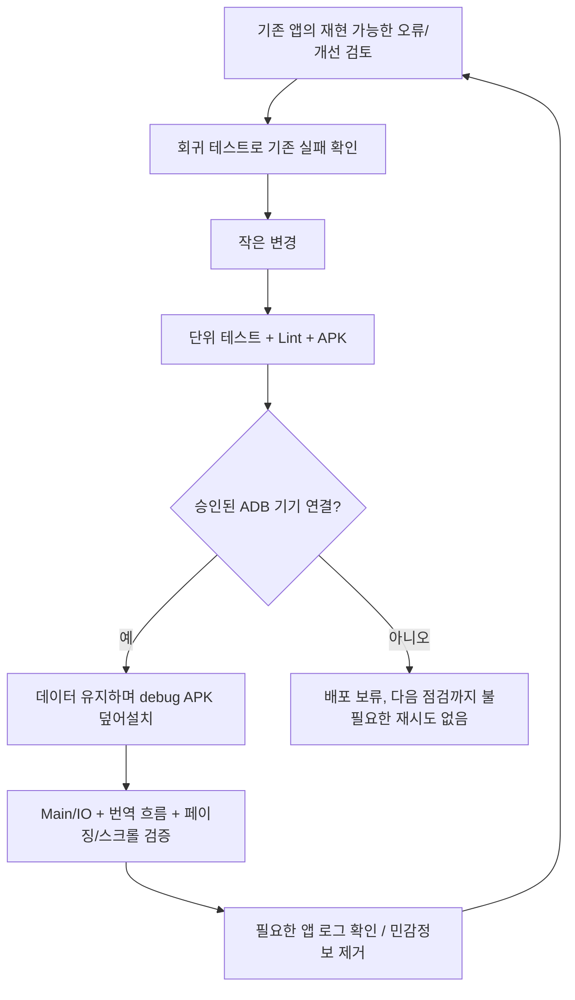

# 로컬 배포·검증·개선 루프

작업 폴더: `/Users/teddy.bear/workspace/PageTurner/.worktrees/app-coordinators`
현재 단계 브랜치: `codex/app-local-validation-loop` (PR #8 기준).
백엔드 worktree, `server/`, 루트 빌드 및 공용 코어는 이 변경에서 수정하지 않습니다.

사용자가 승인한 범위는 앱 디버그 빌드의 로컬 설치, 기존 기능의 검증 및 작은 개선 반복입니다.
데이터 초기화·앱 삭제·비밀 키 복사, 새로운 유료 호출이나 의미 있는 기능 확장은 포함하지 않습니다.

## 2026-09-05 첫 반복

### 재현 및 수정

카탈로그 서비스의 16개 공유 잠금은 서로 다른 페이지의 캐시 키가 같은 슬롯에 해당하면
두 요청을 직렬화했습니다. 느린 선행 로딩이 현재 페이지까지 지연시킬 수 있는 구조였습니다.

충돌하는 서로 다른 페이지 두 개를 찾아 동시에 호출하는 회귀 테스트를 추가했습니다.
두 fixture 공급자가 모두 시작해야 통과하는 검사입니다.

- 기존 구현으로 실행: `TimeoutCancellationException: Timed out waiting for 2000 ms`, 1개 실패.
- 개선 구현: 페이지 키별 잠금으로 변경, 마지막 실행/대기 사용자가 끝나면 잠금 항목 제거.
- 수정 후 동일 테스트 및 전체 앱 검증 통과. 같은 페이지 요청 중복 방지 회귀도 유지.
- 앱 단위 테스트 246개 중 232개 통과·14개 건너뜀·실패 0. 모듈 경계 검사,
  Lint, debug APK 및 instrumentation APK 빌드 성공.

타임아웃 값은 테스트의 동시성 검사 제한이며 실제 기기에서 측정한 사용자 지연값이 아닙니다.
fixture 테스트를 실제 HTTP/LLM/기기 성능 결과로 표시하지 않습니다.

### 배포 상태

이번 반복의 ADB 확인 두 번 모두 `List of devices attached` 아래가 비어 있었습니다.
따라서 APK 설치·instrumentation·실제 앱 화면/프레임 측정은 실행하지 않았습니다.
이전의 덮어설치 승인 대기는 해소되었고, 현재 제약은 기기 미연결입니다.

승인된 기기 식별자: `R3CXB0KNSDL`. 연결이 돌아오면 먼저 기기와 패키지를 확인하고
검증한 APK를 데이터 초기화 없이 설치합니다. 다른 연결 기기에 임의로 설치하지 않습니다.

앱 범위 개선과 기기 연결 확인은 이 대화의 30분 간격 heartbeat로 이어집니다.
상태가 동일하면 알리지 않고 의미 있는 결과·새 실패·사용자 결정이 필요할 때만 알립니다.
앱/호스트가 실행 가능해야 후속 작업이 실제로 진행됩니다.
