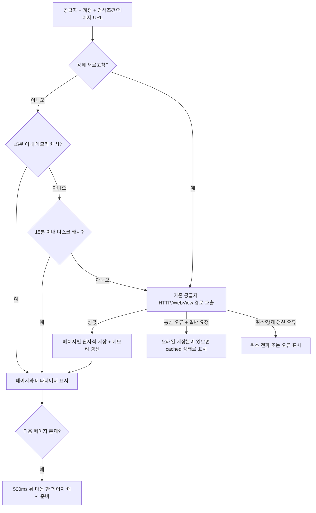

# 앱 페이지 캐시 / 한 페이지 선행 로딩

기준: 앱 기능 분리 PR #7 (`18f1265`). 브랜치: `codex/persistent-web-page-cache`.
작업 폴더는 기존 앱 worktree인 `/Users/teddy.bear/workspace/PageTurner/.worktrees/app-coordinators`를 유지합니다.
이번 단계는 `app/`만 변경하며 별도 백엔드 폴더·공용 코어·루트 Gradle을 수정하지 않습니다.

## 동작



- 키는 공급자·계정·페이지 URL을 길이 접두어로 구분하고 파일명은 SHA-256으로 생성합니다.
  페이지 번호·검색/정렬/필터가 URL에 포함되므로 서로 덮어쓰지 않습니다.
- 목록뿐 아니라 현재/전체 페이지, 전체 항목 수, 이전/다음 여부를 함께 저장합니다.
- 메모리 최대 16페이지, 디스크 최대 64페이지/32 MiB, 단일 캐시 파일 최대 4 MiB.
- 앱 소유 `remote_sources/pages/<sha256>.json`만 정리하며 사용자 책이나 관련 없는 파일은 삭제하지 않습니다.
- 같은 페이지 동시 요청은 잠금을 통해 한 번 호출합니다. 실행/대기 중인 키에만 잠금을 두고
  마지막 사용자가 끝나면 제거합니다. 서로 다른 페이지가 잠금 충돌로 대기하지 않습니다.
- 디스크 손상은 cache miss, 저장 실패는 네트워크 성공 결과를 가리지 않도록 처리합니다.
- 강제 새로고침은 TTL을 무시하며 실패를 오래된 캐시의 성공으로 표시하지 않습니다.
- 통신 오류 때의 오래된 저장본은 cached 상태로 표시하며 화면 페이지 메타데이터를 유지합니다.
- 선행 로딩은 화면 변경 시 취소하고, 실패를 화면 오류로 노출하지 않으며 다음 페이지를 재귀적으로 수집하지 않습니다.
- 실제 호출은 기존 공급자/요청 속도 제한 경로를 사용합니다. 우회 경로를 추가하지 않았습니다.

레거시 카탈로그 색인은 호환 목적으로 남깁니다. 화면에 결과를 먼저 반영하고 색인 쓰기는
실패하더라도 읽기를 막지 않습니다. 최신 요청만 페이지 로딩 단계를 갱신하도록 요청 식별자를 사용합니다.

## 실데이터 검증 — 2026-09-05 21:36 KST

`PersistentWebCatalogPageTest.liveWtrPageSurvivesServiceRestartWithoutAnotherNetworkCall`을
`RUN_LIVE_WEB_NOVEL_TESTS=1`로 단독 실행했습니다. 실패/건너뜀 0, 테스트 1개 통과.

```text
LIVE_PAGE_DISK provider=wtr-lab items=10 pages=9320 networkMs=858 diskMs=4
```

실제 `https://wtr-lab.com/en/novel-list`에서 받은 10개 항목과 페이지 메타데이터를 저장한 뒤,
새 서비스의 공급자 factory를 호출하면 테스트가 실패하도록 설정했습니다. 새 서비스는 디스크에서
읽었고 **목록 전체 데이터와 페이지 메타데이터가 원본과 같은지** 검증했습니다.
디스크 복원에는 두 번째 원격 호출이 없습니다. 위 시간은 단일 실행 관측값이며 P50/P95나 E-Ink
프레임 벤치마크가 아닙니다. 외부 번역 LLM 호출은 이 테스트 범위가 아닙니다.

## 자동 회귀 범위

최종 앱 단위 테스트는 245개 중 231개 통과, 14개 건너뜀, 실패 0입니다.
위 실데이터 테스트는 기본 실행에서 건너뛰고 별도 opt-in 실행에서 1개 통과했습니다.
공용 번역 테스트 9개, 모듈 경계 검사, Lint, debug/instrumentation APK 빌드도 통과했습니다.

- 페이지/계정/검색 조건 분리 및 프로세스 역할의 서비스 재생성 후 복원
- TTL, 강제 새로고침, 통신 실패 때 오래된 저장본, 취소 전파
- 동일 페이지 동시 요청 8개에서 원격 호출 1개
- 손상 캐시 재조회, 미상 전체 페이지/항목 수, 쓰기 실패, 파일 수/용량 상한
- 다음 한 페이지만 요청, 마지막 페이지/오래된 결과에서는 선행 로딩 생략, 실패 격리

다음 단계는 실기기에서 목록 페이징/스크롤과 번역의 Main/IO 동작 확인입니다.
이후 사용자가 디버그 APK 덮어설치를 승인했습니다. 현재 연결 및 배포 상태는
[로컬 검증 루프](LOCAL_VALIDATION_LOOP.md)에 기록합니다.
로컬 비밀 키를 앱 worktree에 복사하거나 기기 데이터를 초기화하지 않았습니다.
