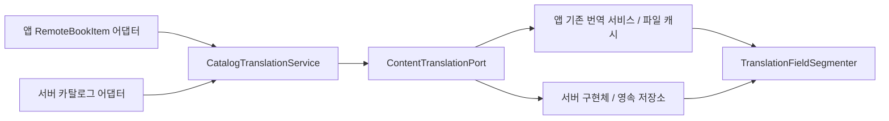

# 공용 번역 실행 계약

Android와 서버가 파일을 복사하지 않고 `:core-translation`을 참조합니다.
프로덕션 의존성은 Kotlin/JVM과 `core-content`뿐입니다. Android, Spring, 코루틴
라이브러리 의존성은 없으며 `suspend` 계약을 사용합니다. 코루틴 테스트는 테스트 의존성입니다.

- `CatalogTranslationService`: 항목 → 한 번의 명명된 필드 묶음 요청 → 제목/설명 결과.
- `ContentTranslationPort`: 공급자와 저장소 구현을 주입하는 경계. 언어는 공용 값으로 전달.
- `TranslationFieldSegmenter`: 400자 분할과 기존 v1 document/segment ID 계산을 공유.
- 자격증명·구독/공급자 선택·재시도·실행 디스패처·HTTP와 DB는 플랫폼 구현체 책임.

서버 작업에서는 이 PR을 merge하거나 공용 변경 커밋을 cherry-pick한 후
`ContentTranslationPort`를 구현합니다. 앱 코드나 Context를 서버로 복사하지 않습니다.
서버의 별도 worktree에는 자동 반영하지 않으며 API/DB 파일을 이 PR에서 변경하지 않습니다.

키는 기존 앱 캐시와의 호환성을 유지합니다. 공급자/계정/책/챕터 키는 어댑터가
제공하고 제목을 식별자로 사용하지 않습니다. 키 인코딩 체계 변경은 별도 마이그레이션이 필요합니다.

검증: `./gradlew -PbuildTarget=core verifyModuleBoundaries :core-translation:test`.
테스트는 실제 공용 코드에 fixture 포트를 주입합니다. 외부 번역 API나 서버 DB의
실동작 검증으로 해석하지 않습니다.
