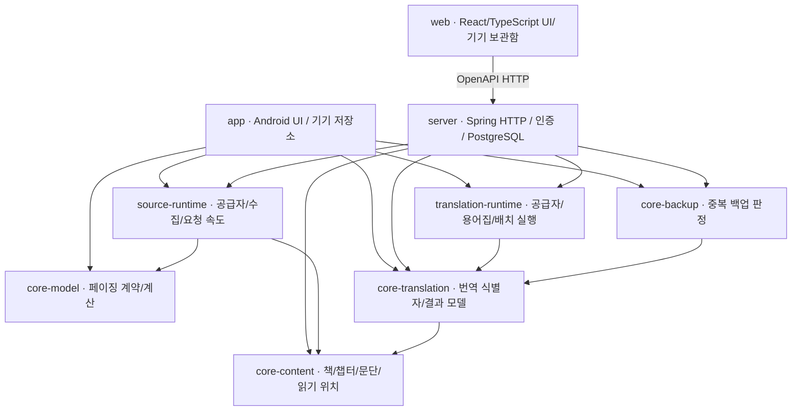

# 앱 / 백엔드 / 공용 코어 작업 분리

작성일: 2026-09-05

2026-09-14 추가: 공통 `TranslationStore` 계약, 서버의 전체 번역 메타데이터 왕복,
앱의 명시적 캐시 publish/restore 및 독립 검증 루프를 추가했습니다.
현재 연동 범위와 제한은 [번역본 저장·조회 연동](TRANSLATION_SYNC.md)을 참고합니다.
같은 날 스텝 2로 독립 `web/` 클라이언트, 사용자별 번역 목록 API, 페이지 리더와
기기 보관함을 추가했습니다. 웹은 공통 OpenAPI에서 TypeScript 타입을 생성하고,
Kotlin 실행 모듈을 참조하지 않습니다. 실행과 저장 범위는 [웹 안내](../web/README.md)를 참고합니다.
같은 날 스텝 3으로 수집·번역 구현을 `source-runtime/`, `translation-runtime/`에 추출했습니다.
서버 원문 보관·번역 작업·문단 checkpoint·완료 artifact 연결은
[소설 수집·번역 작업](NOVEL_TRANSLATION_WORKFLOW.md)에 설명합니다.
아래 최초 브랜치와 2026-09-05 검증 수치는 역사적 기록이며 현재 완료 범위와 구분합니다.

## 이번 단계의 경계

앱과 백엔드는 별도 실행 모듈이며 서로 참조하지 않습니다. 두 실행 모듈이 공용
Kotlin/JVM 모델과 정책을 참조합니다. Voltup의 도메인·실행체 분리 방향을 참고하되,
업무 코드나 프로젝트 고유 설정은 가져오지 않습니다.



코어에는 Android Context, Compose, Spring, JPA, HTTP 서버 코드가 없습니다.
`verifyModuleBoundaries`가 프로젝트 간 참조와 코어의 프레임워크 의존성 유입을 검사합니다.

두 runtime은 Kotlin/JVM 실행 라이브러리입니다. HTTP·JSON·코루틴을 사용할 수 있지만
Android UI/Context, Spring/JPA를 참조하지 않습니다. 코어의 순수 계약과 구분해 의존성을 검사합니다.
앱의 기존 공급자·번역 설정·용어집·배치/속도/비용 추정 구현은 복사본을 만들지 않고 이동했습니다.
기존 package, `TextSegment`와 `DocumentIds`, 공급자·캐시 ID를 유지하여 앱이 같은 클래스를 소비합니다.
`ReaderDocument`/`ReaderPage`, WebView 로더, 로컬 캐시와 UI 큐 상태는 앱에 남습니다.
JSON은 Android 플랫폼과 중복 패키징하지 않도록 runtime에서 compile-only이며 서버가 JVM 구현을 제공합니다.

## 독립 작업 명령

```bash
# Android 및 Spring 실행 모듈을 구성하지 않고 공용 코어만 테스트
./gradlew -PbuildTarget=core verifyModuleBoundaries :core-model:test :core-content:test :core-translation:test :core-backup:test
./gradlew -PbuildTarget=core :source-runtime:test :translation-runtime:test

# 서버 모듈을 구성하지 않고 앱 작업
./gradlew -PbuildTarget=app verifyModuleBoundaries :app:testDebugUnitTest :app:assembleDebug

# Android 모듈을 구성하지 않고 서버 작업
./gradlew -PbuildTarget=server verifyModuleBoundaries :server:bootJar
```

기본값 `buildTarget=all`은 전체 프로젝트를 유지합니다. 공용 runtime도 각 대상에 구성됩니다. `core/server` 대상으로는 앱
프로젝트 자체가 포함되지 않으므로 Android SDK 설정이 필요하지 않습니다. Gradle,
JDK 및 최초 의존성 다운로드는 필요합니다. 코어는 JVM 11, 서버는 JVM 21을 사용합니다.

## 브랜치와 다음 작업

### 다른 작업에 맡길 때의 수정 범위

| 담당 작업 | 주 수정 영역 | 경계 |
| --- | --- | --- |
| 앱 | `app/` | Android UI·기기 저장·플랫폼 어댑터. Spring/JPA를 가져오지 않음 |
| 백엔드 | `server/` | API·인증·DB·서버 어댑터. 앱 클래스나 Android SDK를 가져오지 않음 |
| 공통 계약 | `core-*/` | 양쪽이 소비하는 모델/정책. 변경은 별도 PR로 양쪽 회귀 테스트 |
| 공통 실행 | `source-runtime/`, `translation-runtime/` | 수집/번역 공급자와 순수 실행 정책. 양쪽 호출자와 테스트를 함께 검증 |
| 웹 | `web/`, `contracts/` | OpenAPI 타입 생성, 브라우저 UI·기기 사본. Kotlin/Android 실행체 직접 참조 없음 |
| 빌드 기반 | 루트 Gradle, `gradle/` | 앱/서버 작업에서 동시 변경하지 않고 기반 PR로 조정 |

공유 모델 PR #4를 공통 기준으로 삼습니다. 동일 디렉터리에서 브랜치를 번갈아 바꾸며
작업하지 말고, 별도 worktree에서 앱 작업과 서버 작업을 진행합니다. 서버 기반 PR에
있는 `buildTarget`/경계 검증은 아직 PR #4에는 없으므로 해당 기반 변경을 반영한 뒤
위 독립 명령을 사용합니다. 여기서 새 작업이나 앱 브랜치를 자동 생성하지는 않았습니다.

공용 코어의 public 계약을 바꿀 때는 앱 작업과 서버 작업 양쪽에 변경 내용을 전달하고,
호환되지 않는 필드·키 변경에는 캐시/저장 데이터 이관 계획을 포함합니다. 앱의 실제
화면 페이지 번호를 서버의 영속 챕터·문단 식별자로 사용하지 않습니다.

| 작업 | 브랜치 | 상태 |
| --- | --- | --- |
| UI와 페이지 계산 분리 | `codex/core-paging-ui-decoupling` | PR #3 |
| 공유 데이터 모델 및 앱 번역 캐시 키 연결 | `codex/shared-content-contracts` | PR #4 |
| 서버 초기 구성 및 독립 빌드 경계 | `codex/spring-boot-backend-foundation` | 작업 중 |

2026-09-05 최초 완료 범위는 **공용 모델·페이징·번역 식별자·백업 판정 코어 추출**이었습니다.
2026-09-14에는 캐시 저장·복원 계약과 실제 DB 왕복, 웹 서재·리더, 공통 수집/번역 runtime,
서버 원문·작업·checkpoint·완료 결과 저장을 추가했습니다. 모든 기존 기능의 서버 이전이 끝난 것은 아닙니다.
남은 플랫폼·서비스 작업은 다음과 같습니다.

- 앱의 WebView/기기 저장/페이지 UI를 유지하면서 서버 사본과 읽기 위치를 동기화
- 임의로 분할/병합된 앱 페이지 캐시와 공통 문단 간 변환 확장
- 공개 서비스용 계정·운영·할당량 및 Android/E-Ink 실기기 검증
- Drive OAuth·업로드·복원 및 사용자 계정 실검증

최초 분리 단계에서 서버 부팅 JAR 생성은 코드 조립 검증이며, 실제 DB 저장이나 Drive
백업 성공을 뜻하지 않습니다. 앱 단위 테스트 또한 ADB 실기기 검증과 구분합니다.

## 이번 검증 결과

2026-09-05 로컬 실행 결과:

- `buildTarget=core`: 코어 10개 테스트 재실행, 실패/건너뜀 0개.
- `buildTarget=server`: 모듈 경계 검사와 `bootJar` 성공. Android 프로젝트 미포함.
- `buildTarget=app`: APK 빌드 성공. 단위 테스트 총 217개 중 204개 통과, 13개 건너뜀.
- 전체 모듈 구성에서도 경계 검사와 위 산출물 검증 성공.
- 임시 Gradle init script로 코어에 Spring 의존성을 주입하자 경계 검사 실패(기대 결과).
- 임시 Gradle init script로 앱에 서버 의존성을 주입하자 경계 검사 실패(기대 결과).

외부 사이트·LLM 실호출, PostgreSQL 저장, Drive 백업, ADB 기기 테스트는 이번
분리 검증에서 실행하지 않았습니다. 건너뛴 테스트를 통과로 집계하지 않습니다.
