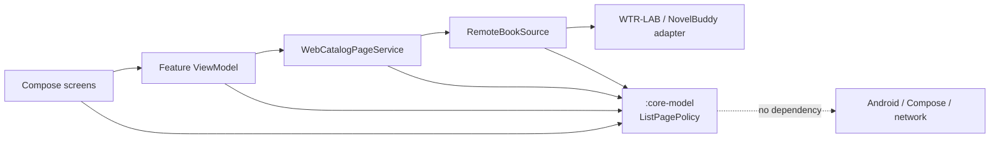
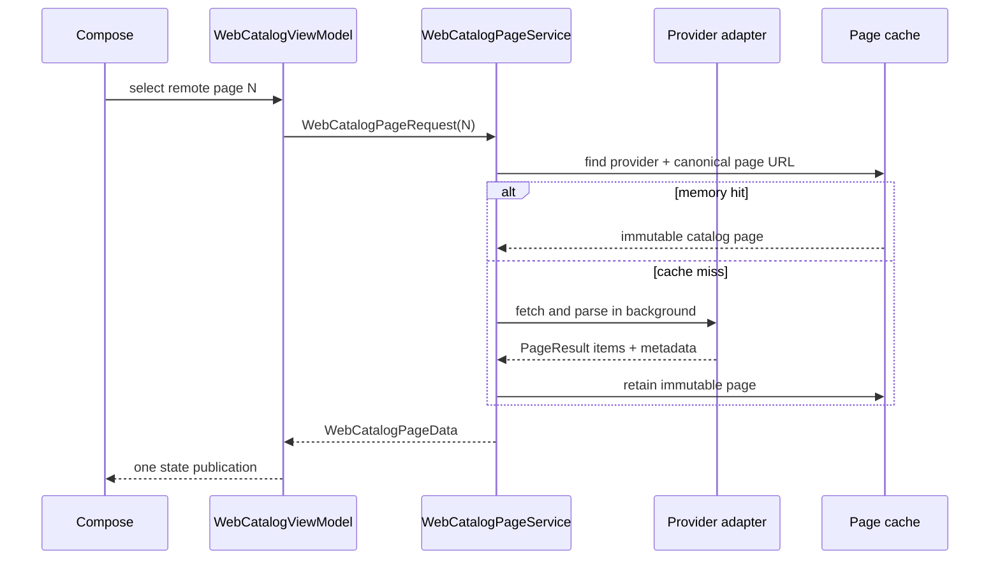

# Core Paging Architecture

PageTurner keeps page identity, slicing, and remote-page metadata outside Android
and Compose. The `:core-model` Gradle module is pure Kotlin, so providers and
reader policies can be tested without launching the app.

## Dependency direction

The arrows point from a consumer to a dependency. `:core-model` never imports an
Android, Compose, HTTP, DOM, database, or provider-specific type.

## Shared contracts

- `PageRequest` describes a one-based provider page request.
- `PageResult<T>` exposes items and immutable page metadata.
- `PageLoader<T>` is the provider-neutral loading boundary.
- `ListPagePolicy` slices a measured collection and clamps an invalid page index.
- `AlignedPageWindowPolicy` owns stable reader blocks such as 1-10, 11-20, and
  21-30.

WTR-LAB and NovelBuddy retain their own URL and DOM implementations, but both
publish the same `PageResult<T>`. UI code therefore does not know which query
parameter or selector a provider uses.

## Runtime flow

DOM parsing and cached JSON decoding run away from the main dispatcher. Cover
prefetching publishes one combined state update instead of one recomposition per
cover. The UI continues to use `AdaptiveCollection`; only the reusable page math
moved into the core module.

## Next extraction boundaries

`WebCatalogViewModel` still coordinates catalog translation, offline download,
navigation state, and cover prefetching. Those are intentionally not part of
core paging. The next safe splits are `CatalogTranslationCoordinator`,
`OfflineBookDownloadCoordinator`, and `CoverThumbnailRepository`, each exposing
an immutable result back to the ViewModel.
