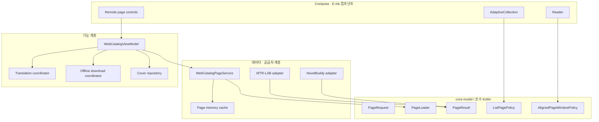
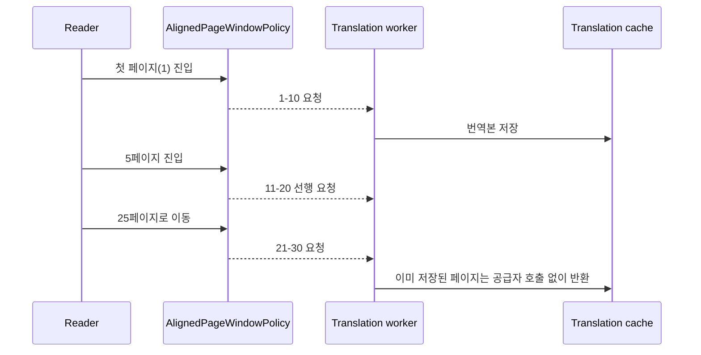

# 코어 페이징 · UI 분리 리팩터링 계획

작업 브랜치: `codex/core-paging-ui-decoupling`

기준 브랜치: `codex/deepseek-translation-provider` (번역 선행 로딩 정책을 포함한
스택 브랜치)

## 목표

웹소설 공급자, 로컬 저장소, 번역 선행 로딩이 같은 페이지 개념을 공유하도록
순수 Kotlin 코어 모델을 두고, Compose는 이미 계산된 불변 데이터를 렌더링하는
역할만 맡습니다. 화면을 열거나 페이지를 바꿀 때 발생하는 DOM 파싱, 캐시 복원,
이미지 준비 작업은 메인 스레드와 분리합니다.

이번 리팩터링은 화면 디자인을 전면 교체하는 작업이 아닙니다. 기존 E-Ink 공통
컴포넌트인 `AdaptiveCollection`을 유지하면서 데이터 경계와 계산 책임을 먼저
분리합니다.

## 목표 구조

## 단계별 작업

### 1단계 — 코어 모델 분리 (이번 브랜치에서 완료)

- Android/Compose 의존성이 없는 `:core-model` Gradle 모듈 추가
- `PageRequest`, `PageResult<T>`, `PageLoader<T>`, `PageMetadata` 정의
- 빈 목록과 마지막 페이지를 안전하게 처리하는 `ListPagePolicy` 정의
- 1–10, 11–20, 21–30처럼 범위가 흔들리지 않는
  `AlignedPageWindowPolicy` 정의
- WTR-LAB과 NovelBuddy의 페이지 결과를 공통 계약으로 연결

완료 조건은 JVM 단위 테스트만으로 범위 정렬, 마지막 페이지, 잘못된 페이지
인덱스 보정을 검증하는 것입니다.

### 2단계 — 카탈로그 데이터 경계 분리 (이번 브랜치에서 완료)

- `WebCatalogPageService`가 공급자 선택, 실제 호출, DOM 파싱, 결과 매핑,
  메모리 페이지 캐시를 소유
- `WebCatalogViewModel`은 요청과 불변 결과 반영만 담당
- DOM 및 저장 캐시 파싱은 메인 디스패처 밖에서 수행
- 표지 이미지는 항목마다 상태를 갱신하지 않고 묶어서 한 번 반영
- Compose의 목록 슬라이싱 계산을 코어 정책으로 이동

완료 조건은 UI 없이 실제 WTR-LAB 페이지를 불러오고, 같은 페이지의 두 번째
호출이 공급자를 다시 호출하지 않는 것입니다.

### 3단계 — ViewModel 기능 코디네이터 분리 (후속 작업)

- `CatalogTranslationCoordinator`: 목록 제목/설명 번역 및 캐시 상태
- `OfflineBookDownloadCoordinator`: 원문/번역본 다운로드 진행률과 재시도
- `CoverThumbnailRepository`: 표지 요청 취소, 캐시, 크기 제한
- ViewModel은 화면 경로와 각 코디네이터의 결과 조합만 담당

한 번에 모두 분리하지 않고, 각 코디네이터마다 기존 회귀 테스트를 먼저 옮긴
뒤 ViewModel 코드를 제거합니다.

### 4단계 — 영속 페이지 캐시와 선행 로딩 (후속 작업)

- 메모리 캐시 앞에 디스크 페이지 캐시를 추가하여 앱 재실행 후 즉시 표시
- 캐시 키는 `provider + account + canonical page URL`로 고정
- 현재 페이지 다음 한 페이지만 낮은 우선순위로 선행 로딩
- 공급자별 요청 간격과 `Retry-After`를 그대로 준수
- 최신성 정책(TTL)과 사용자가 누르는 강제 새로고침을 분리

선행 로딩은 무제한 자동 순회가 아니며, 봇 탐지와 배터리 사용을 피하기 위해
현재 페이지 주변의 제한된 범위만 대상으로 합니다.

### 5단계 — E-Ink 실기기 성능 검증 (기기 연결 시)

- 목록 페이징/스크롤 각각 동일 데이터와 동일 화면에서 5회 측정
- 첫 표시, 다음 페이지, 이전 페이지, 캐시 재방문을 별도 측정
- `dumpsys gfxinfo`의 janky frame, P90/P95/P99와 총 프레임 수 기록
- 화면 잘림, 고정 네비게이션 슬롯, 전체화면, 볼륨키 전환 회귀 확인
- 물리 E-Ink에서는 잔상, 패널 정착 시간, 전체 새로고침 횟수도 수동 기록

ADB 기기가 없을 때는 instrumentation APK 컴파일까지만 통과로 기록하고,
실기기 성능을 검증했다고 간주하지 않습니다.

## 번역 페이지 정책

25페이지에서 25–34를 만드는 가변 범위를 사용하지 않습니다. 같은 책의 어느
진입점에서도 페이지 블록의 ID가 같아야 저장된 번역과 선행 번역을 재사용할 수
있기 때문입니다.

## 검증 매트릭스

| 영역 | 자동 검증 | 기기 검증 |
| --- | --- | --- |
| 코어 페이지 범위/슬라이스 | `:core-model:test` | 불필요 |
| 번역 1–10 / 11–20 / 21–30 | JVM + instrumentation workflow | Logcat 단계 확인 |
| 공급자 페이지 매핑/캐시 | 가짜 공급자 단위 테스트 | 불필요 |
| WTR-LAB 실제 DOM | opt-in live JVM 테스트 | 불필요 |
| Android 회귀 | unit, lint, APK 및 test APK 빌드 | 선택 |
| E-Ink 체감/프레임/잔상 | 불가능 | 필수 |

## 브랜치 완료 기준

- 전체 debug 단위 테스트, Lint, debug APK 빌드 통과
- Android instrumentation APK 컴파일 통과
- 실제 WTR-LAB 페이지의 HTTP/DOM/메모리 캐시 흐름 통과
- 신규 화면에서 직접 `LazyColumn` 또는 `verticalScroll`을 추가하지 않음
- 구조, 실데이터 결과, 남은 작업을 문서에 기록
- 연결된 ADB 기기가 없으면 그 사실과 미실행 범위를 명시

## 후속 브랜치 제안

각 변경의 회귀 범위를 작게 유지하기 위해 아래 작업은 별도 브랜치로 진행합니다.

1. `codex/catalog-feature-coordinators`
2. `codex/persistent-web-page-cache`
3. `codex/eink-device-performance-pass`

각 브랜치는 앞 단계가 병합된 커밋을 기준으로 시작하며, UI 디자인 변경과 데이터
계층 변경을 같은 커밋에 섞지 않습니다.
