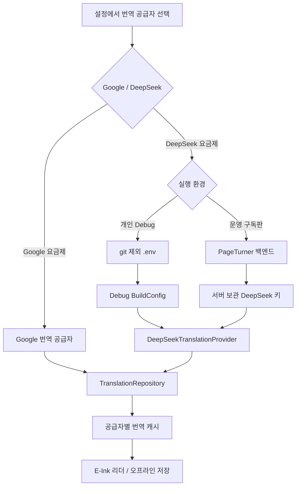

# DeepSeek 번역 시스템

PageTurner는 Google 번역과 DeepSeek AI 번역을 서로 다른 공급자 및 구독 요금제로
취급합니다. 번역 캐시 키에는 공급자 ID가 포함되므로 같은 책과 언어 조합이라도
Google 결과와 DeepSeek 결과가 서로 덮어쓰이지 않습니다.

## 공급자와 요금제

| 설정 항목 | 구현체 | 요금제 식별자 | 인증 방식 |
| --- | --- | --- | --- |
| Google Cloud / Google Web | `GoogleCloudTranslationProvider` / `GoogleWebTranslateHtmlProvider` | `GOOGLE_TRANSLATE` | Google 키 또는 공개 Web 경로 |
| DeepSeek AI | `DeepSeekTranslationProvider` | `DEEPSEEK_AI` | 로컬 Debug `.env`, 운영 백엔드 구독 토큰 |
| 사용자 LLM API | `OpenAiCompatibleLlmTranslationProvider` | `CUSTOM_API` | 사용자가 입력한 API 키 |

설정 화면의 공급자 선택은 `EinkSegmentedControl`을 사용합니다. 선택 상태는
`ReaderSettingsStore`에 저장되며 Google과 DeepSeek가 별도의 선택지와 요금제
표시를 가집니다.

## 로컬 개발 설정

저장소 루트에 다음 `.env`를 만듭니다. 실제 `.env`는 `.gitignore`에 포함되고
`.env.example`만 커밋합니다.

```dotenv
DEEPSEEK_API_KEY=replace-with-a-rotated-key
DEEPSEEK_API_URL=https://api.deepseek.com/chat/completions
DEEPSEEK_MODEL=deepseek-v4-flash
```

Gradle은 환경 변수를 우선 사용하고 값이 없으면 루트 `.env`를 읽습니다. API 키는
Debug `BuildConfig`에만 주입하며 Release 빌드의 `DEEPSEEK_API_KEY`는 항상 빈
문자열입니다. 설정 화면은 `.env` 키의 존재 여부만 보여 주며 키 자체를 표시하거나
DataStore에 저장하지 않습니다.

Debug APK에 주입된 값은 역공학으로 추출할 수 있으므로 이 방식은 개인 개발판 전용입니다.
배포용 구독 서비스에서는 DeepSeek 키를 앱에 넣지 않고 백엔드가 보관해야 합니다.

## 요청 형식

공식 DeepSeek Chat Completions 경로에 다음 정책으로 요청합니다.

- 모델: `deepseek-v4-flash`
- `response_format.type`: `json_object`
- `thinking.type`: `disabled`
- `stream`: `false`
- 응답 계약: 입력 문단과 동일한 개수·순서의 `translations` 배열

리더의 롤링 번역과 전체 오프라인 번역은 페이지별로 API를 호출하지 않습니다.
`TranslationRequestBatcher`가 최대 10페이지의 문단을 하나의 요청으로 합치고, 응답의
문단 ID를 이용해 각 페이지 캐시로 다시 분배합니다. 기본 안전 한도는 요청당 24문단 또는
24,000자이며 둘 중 하나를 넘을 때만 여러 요청으로 분할합니다. 이미 번역된 문단은 요청에서
제외되므로 일부 캐시가 있는 경우에도 중복 과금하지 않습니다.

공식 문서에서 Chat Completions는 `POST /chat/completions`와 Bearer 인증을
사용하며, JSON Output을 사용할 때 프롬프트에서도 JSON 생성을 지시해야 한다고
명시합니다.

- [DeepSeek Chat Completions API](https://api-docs.deepseek.com/api/create-chat-completion/)
- [DeepSeek 공식 curl 예제](https://api-docs.deepseek.com/api_samples/chat_curl/)
- [DeepSeek 모델 및 가격](https://api-docs.deepseek.com/quick_start/pricing/)

## 로컬과 운영 흐름



현재 코드는 개인 Debug 직접 호출을 구현했습니다. 운영 구독판의 결제 검증과 백엔드
프록시는 후속 서버 작업이며, `TranslationProvider` 경계를 유지하므로 리더와
오프라인 저장 로직을 바꾸지 않고 교체할 수 있습니다.

## 실제 API 검증

`2026-08-15`에 루트 `.env` 키와 운영 HTTP 구현으로 실제 유료 API를 호출했습니다.
fixture나 가짜 transport를 사용하지 않았으며 결과는 다음과 같습니다.

| 항목 | 실측 결과 |
| --- | --- |
| 모델 | `deepseek-v4-flash` |
| 입력 | 영어 2문단 |
| 출력 | 한국어 2문단 |
| 문단 ID/순서 | 입력과 일치 |
| JSON 응답 파싱 | 성공 |
| 한글 포함 검증 | 성공 |
| 10페이지 묶음 단일 요청 | 성공 |

실제 반환값:

1. `비행기가 구름을 지나며 기내 조명이 어두워졌다.`
2. `그녀는 소설을 펴고 오프라인으로 계속 읽었다.`

테스트는 API 키를 출력하지 않고 다음 증거만 JUnit 로그에 기록합니다.

```text
LIVE_DEEPSEEK_EVIDENCE
model=deepseek-v4-flash
segments=2
korean=true
```

## 테스트

```bash
./gradlew :app:testDebugUnitTest :app:lintDebug :app:assembleDebug

RUN_LIVE_DEEPSEEK_TESTS=1 ./gradlew :app:testDebugUnitTest \
  --tests 'com.dongholab.pagetuner.translation.DeepSeekTranslationLiveTest' \
  --rerun-tasks
```

`DeepSeekTranslationProviderTest`는 Bearer 헤더, 공식 endpoint/model, JSON Output,
non-thinking 모드, 문단 ID 보존을 가짜 transport로 검증합니다. 실제 유료 호출은
기본 테스트에서 제외하고 명시적인 환경 변수로만 실행합니다.
