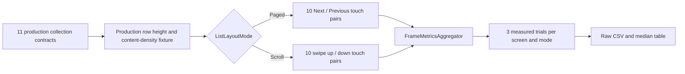

# E-Ink Collection Layout Benchmark

This document compares PageTurner's discrete touch paging and opt-in continuous
touch scrolling across every production screen that uses `AdaptiveCollection`.
Raw results are stored in
[the measured CSV](benchmarks/eink-screen-layout-benchmark-2026-08-16.csv).

## Full-screen collection benchmark

### Scope and coverage

The benchmark inventory is derived from production `AdaptiveCollection` call
sites. A JVM coverage test fails when a new call site is added without updating
the benchmark inventory.

| Screen surface | Production owner | Paged row | Fixture items | Touch-scroll behavior |
| --- | --- | ---: | ---: | --- |
| Local · Library | `LocalLibraryPanel` | 124 dp | 48 | Same fixed row |
| Local · Device files | `LocalDirectoryBrowserPanel` | 64 dp | 48 | Same fixed row |
| Favorites | `FavoritesPanel` | 116 dp | 48 | Same fixed row |
| Web Novel · Catalog page | `WebCatalogPagePanel` | 104 dp | 80 | Expanded 132 dp row |
| Web Novel · Root catalog | `RemoteSourcesTodoPanel/catalog` | 104 dp | 80 | Expanded 132 dp row |
| Web Novel · Chapter dialog | `WebNovelDetailDialog` | 64 dp | 80 | Same fixed row |
| Web Novel · Book chapters | `WebNovelDetailPagePanel` | 100 dp | 120 | Expanded 124 dp row |
| Drive/FTP · Accounts | `RemoteSourcesTodoPanel/accounts` | 112 dp | 48 | Same fixed row |
| Reader · Book dictionary | `BookGlossaryPanel` | 92 dp | 60 | Same fixed row |
| Reader · Bookmarks | `ReaderBookmarkPanel` | 64 dp | 48 | Same fixed row |
| Reader · Notes | `ReaderAnnotationPanel` | 76 dp | 48 | Same fixed row |

The reader body is intentionally excluded: it remains document-page based and
does not follow `ListLayoutMode`. Settings, overview, loading, empty, and form
surfaces do not contain a comparable dynamic collection, so inventing a scroll
branch for them would test a UI that the application does not provide.



### Measurement environment

| Item | Value |
| --- | --- |
| Date | 2026-08-16 |
| Device | Android Emulator `Medium_Phone_API_35`, API 35 |
| Viewport | 1080 × 2400, 420 dpi |
| Build | Debug APK and AndroidTest APK |
| Renderer | Real Compose `AdaptiveCollection` and Material surfaces |
| Isolation | Network, disk, and cover decoding removed |
| Warm-up | 1 trial per screen and mode |
| Measurement | 3 trials per screen and mode |
| Inputs per trial | 20: 10 forward/backward pairs |
| Paged input | `Next -> Previous`, wait until Compose is idle |
| Scroll input | 80 ms `swipe up -> swipe down`, wait until fling is settled |
| Metrics | `FrameMetricsAggregator`, `Debug.getPss`, monotonic host duration |
| Jank definition | Total frame duration greater than 17 ms |

Every fixture keeps its production paged row height, text-line density, action
count, item count class, and thumbnail placeholder. This isolates collection
layout cost; the numbers do not include live HTTP calls, file reads, image
decoding, translation, or E-Ink panel refresh latency.

### Results

Each value below is the median of three measured trials. Scenario time includes
the injected gesture and, for scrolling, fling settlement. It is useful for the
end-to-end interaction comparison but is not a raw tap-to-frame latency.

| Screen | Paged frames | Scroll frames | Paged jank | Scroll jank | Paged P90 | Scroll P90 | Paged time | Scroll time |
| --- | ---: | ---: | ---: | ---: | ---: | ---: | ---: | ---: |
| Local · Library | 153 | 535 | 11.11% | 13.27% | 20 ms | 21 ms | 2,622 ms | 10,433 ms |
| Local · Device files | 149 | 510 | 0.00% | 13.44% | 17 ms | 20 ms | 2,519 ms | 9,249 ms |
| Favorites | 148 | 534 | 0.00% | 13.16% | 17 ms | 21 ms | 2,504 ms | 9,932 ms |
| Web Novel · Catalog page | 144 | 88 | 0.00% | 22.73% | 17 ms | 67 ms | 2,453 ms | 3,566 ms |
| Web Novel · Root catalog | 149 | 88 | 0.00% | 23.86% | 17 ms | 71 ms | 2,522 ms | 3,899 ms |
| Web Novel · Chapter dialog | 154 | 534 | 0.00% | 22.83% | 17 ms | 24 ms | 2,601 ms | 10,015 ms |
| Web Novel · Book chapters | 147 | 87 | 0.00% | 22.99% | 17 ms | 50 ms | 2,486 ms | 3,216 ms |
| Drive/FTP · Accounts | 144 | 526 | 0.00% | 8.59% | 17 ms | 17 ms | 2,453 ms | 9,799 ms |
| Reader · Book dictionary | 149 | 535 | 0.00% | 22.43% | 17 ms | 24 ms | 2,520 ms | 10,049 ms |
| Reader · Bookmarks | 146 | 516 | 0.00% | 0.39% | 17 ms | 17 ms | 2,485 ms | 9,366 ms |
| Reader · Notes | 147 | 520 | 0.00% | 9.62% | 17 ms | 17 ms | 2,504 ms | 9,349 ms |

Across the 11 screen medians:

| Metric | Paged | Touch scroll | Scroll / Paged |
| --- | ---: | ---: | ---: |
| Frames | 148 | 520 | 3.51× |
| Janky-frame ratio | 0.00% | 13.44% | — |
| P50 | 17 ms | 17 ms | 1.00× |
| P90 | 17 ms | 21 ms | 1.24× |
| P95 | 17 ms | 24 ms | 1.41× |
| P99 | 17 ms | 39 ms | 2.29× |
| Settled scenario time | 2,504 ms | 9,366 ms | 3.74× |
| Total PSS | 203,823 KB | 205,659 KB | 1.01× |

The three expanded-row web screens submit fewer scroll frames than paged
frames, but this is not a win: their median P90 rises to 50–71 ms because a
smaller number of more expensive frames is presented while taller content
settles. Frame count must therefore be read together with the latency tail.

### Decision and improvement targets

`ListLayoutMode.Paged` remains the default on every collection screen. It
minimizes intermediate display states, has the shorter latency tail, and avoids
fling settlement—the three properties that matter most on E-Ink panels.

`ListLayoutMode.Scroll` remains available as an explicit touch-oriented option.
Memory use is effectively equal, so the trade-off is refresh work and latency,
not retained heap.

The results also identify paged-mode work rather than declaring it perfect:

1. Local Library retained an 11.11% median paged jank ratio while every other
   paged screen had a 0% median; its metadata and thumbnail row needs the next
   physical E-Ink pass.
2. Expanded catalog/chapter rows should avoid additional synchronous cover or
   offline-state work during a swipe; precomputed row state is preferred.
3. Page replacement should preserve stable keys and cached thumbnails so its
   occasional expensive P99 update does not grow with remote data.
4. Physical-device testing is still required for ghosting, vendor refresh mode,
   full-refresh count, battery, and actual panel settle time.

### Reproduction

```bash
./gradlew :app:connectedDebugAndroidTest \
  -Pandroid.testInstrumentationRunnerArguments.class=com.dongholab.pagetuner.ui.common.AdaptiveCollectionScreenBenchmarkTest
```

The instrumentation test writes `eink-screen-layout-benchmark.csv` to the
Android Gradle Plugin additional-test-output directory when available. The
checked-in raw run contains 66 rows: 11 screens × 2 modes × 3 trials.

Run the inventory guard independently with:

```bash
./gradlew :app:testDebugUnitTest \
  --tests com.dongholab.pagetuner.ui.AdaptiveCollectionBenchmarkCoverageTest
```

## Appendix: earlier single-catalog ADB baseline

This document compares the two `AdaptiveCollection` branches with the same
application build and real cached web-catalog data. It is a reproducible Android
rendering benchmark, not a substitute for measuring refresh latency, ghosting,
or battery use on physical E-Ink hardware.

### Test environment

| Item | Value |
| --- | --- |
| Date | 2026-08-16 |
| Device | Android Emulator, API 35 |
| Viewport | 1080 x 2400, 420 dpi |
| Additional layout check | 1080 x 1800 |
| Build | Debug APK, warmed process and image cache |
| Data | 10 cached WTR-LAB catalog items |
| Tooling | `adb shell dumpsys gfxinfo`, `dumpsys meminfo`, UI Automator |

Both modes used the same catalog route, item rows, process, data, and viewport.
Before every trial, graphics counters were reset. Each mode ran five measured
trials after a separate warm-up.

- Paged: 15 `Next -> Previous` pairs, 30 page-button inputs per trial.
- Scroll: 15 `swipe up -> swipe down` pairs, 30 swipe inputs per trial. Each
  injected swipe had an 80 ms gesture duration.

The host scenario duration includes ADB input injection. It is included for
reproducibility but must not be interpreted as direct touch-to-frame latency,
because a swipe deliberately lasts longer than a tap.

### Results

| Metric | Paged | Scroll | Interpretation |
| --- | ---: | ---: | --- |
| Frames per trial, mean | 183.8 | 245.2 | Scroll generated 33.4% more Android frames |
| Janky frames, total | 10 / 919 | 89 / 1,226 | 1.09% vs 7.26% |
| P50 frame time, median trial | 16 ms | 16 ms | Typical frame was equal |
| P90 frame time, median trial | 16 ms | 21 ms | Scroll had a longer sustained tail |
| P95 frame time, median trial | 17 ms | 32 ms | Scroll had more continuous slow frames |
| P99 frame time, median trial | 117 ms | 65 ms | Paged had rarer but heavier discrete updates |
| Scenario duration, mean | 2,230 ms | 4,126 ms | Not directly comparable; swipe contains 80 ms gesture time |
| Total PSS, mean | 173,419 KB | 172,339 KB | Difference was about 0.6%, within run-to-run noise |

Raw measured trials:

| Mode | Trial | Frames | Janky frames | P90 | P95 | P99 | Host time | Total PSS |
| --- | ---: | ---: | ---: | ---: | ---: | ---: | ---: | ---: |
| Paged | 1 | 182 | 3 | 16 ms | 109 ms | 133 ms | 2,225 ms | 161,643 KB |
| Paged | 2 | 185 | 1 | 16 ms | 17 ms | 117 ms | 2,234 ms | 181,219 KB |
| Paged | 3 | 187 | 3 | 17 ms | 105 ms | 150 ms | 2,301 ms | 161,687 KB |
| Paged | 4 | 180 | 2 | 16 ms | 17 ms | 117 ms | 2,155 ms | 181,283 KB |
| Paged | 5 | 185 | 1 | 16 ms | 17 ms | 117 ms | 2,234 ms | 181,263 KB |
| Scroll | 1 | 235 | 30 | 23 ms | 38 ms | 65 ms | 4,310 ms | 152,438 KB |
| Scroll | 2 | 258 | 8 | 17 ms | 22 ms | 32 ms | 4,044 ms | 182,006 KB |
| Scroll | 3 | 255 | 8 | 22 ms | 24 ms | 32 ms | 4,037 ms | 170,222 KB |
| Scroll | 4 | 238 | 24 | 20 ms | 32 ms | 65 ms | 4,109 ms | 190,674 KB |
| Scroll | 5 | 240 | 19 | 21 ms | 32 ms | 77 ms | 4,132 ms | 166,354 KB |

### Layout and reachability check

UI Automator was also used at 1080 x 1800 to verify the short viewport.

- Paged displayed two complete catalog rows, both `Details` and `Import`
  actions, and the previous/next navigation bar.
- Scroll displayed three complete catalog rows and all six corresponding
  actions inside the clipped scroll viewport.
- Neither mode exposed a row or action beyond the collection boundary.
- The physical viewport was reset to 1080 x 2400 after the test.

### Decision

`ListLayoutMode.Paged` remains the E-Ink default. It generated fewer intermediate
frames and about one seventh of the jank ratio in this emulator run, matching
the goal of minimizing display state changes on slow-refresh panels. Its high
P99 values show that a discrete page replacement can still be an expensive
single update, so physical-device refresh latency must also be checked.

`ListLayoutMode.Scroll` remains an explicit touch-oriented option. It uses
similar memory and provides continuous browsing, but produces more intermediate
display states. On real E-Ink hardware, those states are expected to increase
ghosting and refresh work; this is an inference from the Android frame results,
not a measured hardware claim.

### Physical E-Ink follow-up

Repeat the same warmed-data scenario on at least one target device and record:

1. Tap-to-complete page refresh latency for Paged.
2. Swipe-to-settled refresh latency for Scroll.
3. Ghosting after 30 forward/backward operations.
4. Full-refresh count and vendor refresh mode, if exposed by the device SDK.
5. Battery delta over a longer fixed-duration navigation run.
