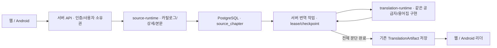

# 소설 원문 수집과 공통 번역 실행

2026-09-14 구현. 앱·서버가 같은 Kotlin 수집·번역 구현을 사용하고, 웹은 HTTP 계약으로 접근합니다.
번역 결과 저장 계약은 [기존 저장·복원 문서](TRANSLATION_SYNC.md), 전체 wire 타입은
[OpenAPI](../contracts/translation-v1.openapi.json)를 기준으로 합니다.

## 실행 경계



`source-runtime`에는 WTR-LAB, NovelBuddy, 일반 HTML의 기존 어댑터·파서·요청 속도 정책이 있습니다.
`NovelSourceService`가 주입받은 `NovelHttpTransport`를 상세 목록과 WTR reader POST까지 일관되게 사용합니다.
서버는 공개 HTTPS/DNS 검증 HTTP 구현을 주입하고 WebView를 사용하지 않습니다.
앱의 실제 WebView 구현과 기기 캐시는 Android 모듈에 남습니다.

### WTR 웹 화면과 서버 호출 경로

웹의 `NovelWorkspace`와 `workflowApi`는 아래 서버 API를 호출합니다. WTR의 Next.js
데이터 해석, 목차 구성, reader POST와 원문 문단 생성은 서버가 주입한 HTTP transport와
공통 `NovelSourceService` / `WtrLabSiteAdapter` / `WtrLabDomScraper`에서 처리합니다.
브라우저에 WTR 전용 파서나 reader POST를 복제하지 않습니다.

| 프론트 동작 | 호출 API | 서버 책임 |
| --- | --- | --- |
| WTR 선택·검색·필터 | `GET /api/v1/novels/catalog?sourceId=wtr-lab` | WTR 목록 요청과 구조화된 작품 정보 반환 |
| 작품 선택·목차 넘기기 | `GET /api/v1/novels/detail` | 작품 정보와 목차 해석, 회차 페이지 반환 |
| 회차 가져오기 | `POST /api/v1/chapters/import` | WTR reader 호출, 작품·회차 식별자 검증, 사용자별 원문 DB 저장 |
| 전체 번역 시작 | `POST /api/v1/translation-jobs` | 저장 원문 조회, 공급자 실행과 문단 checkpoint 저장 |
| 번역 진행·완료 보기 | `GET /api/v1/translation-jobs/{jobId}` | 작업 상태와 완성된 translationRecordId 반환 |
| 번역 리더 열기 | `GET /api/v1/translations/{recordId}` | 검증된 완성 artifact 조회 |

프론트의 목록 캐시는 서버에서 받은 구조화된 응답의 기기 사본입니다. 새로 받기를 누르면
서버 조회를 다시 실행하며, 캐시 사용과 새 서버 응답을 화면에서 구분합니다.

`translation-runtime`에는 Google Cloud, 키 없는 Google Web public POST/키 있는 HTML 경로,
DeepSeek, OpenAI 호환 API와 기존 용어집 보호·한국어 조사 보정·배치·속도·비용 추정이 있습니다.
기존 앱 클래스는 동일 package로 이동했으므로 앱과 서버가 다른 복사본을 실행하지 않습니다.
`ChapterTranslationEngine`은 원문 `ChapterContent`와 `TranslationSettings`, 선택적 `BookGlossary`,
완료된 문단의 ID→번역 맵, checkpoint/progress callback을 받습니다.
`TranslationRuntimeIdentity.describe`가 공급자 endpoint hash/model, 유효 프롬프트·사전 revision을 제공합니다.

## API

모든 API는 현재 사용자로 범위를 제한합니다. 로컬 개발 인증은 HTTP Basic입니다.
쓰기는 먼저 인증된 `GET /api/v1/csrf`로 받은 토큰과 같은 세션 쿠키를 사용합니다.
브라우저에서는 API와 같은 origin을 사용하고 비밀번호/API 키를 URL에 넣지 않습니다.

| 메서드·경로 | 동작 |
| --- | --- |
| `GET /api/v1/novel-sources` | 공급자 ID·기본 카탈로그·검색 지원 목록 |
| `GET /api/v1/novels/catalog?sourceId=wtr-lab&query=...&page=1` | 실제 공급자 카탈로그 조회; 카탈로그 페이지는 1부터 시작 |
| `GET /api/v1/novels/detail?url=...&page=0&size=20` | 책 정보와 전체 목차를 바탕으로 한 챕터 페이지 |
| `POST /api/v1/chapters/import` | `{url, bookUrl?}`의 챕터 본문을 수집해 원문 사본 저장 |
| `GET /api/v1/chapters?page=0&size=12` | 사용자별 원문 보관 목록 |
| `GET /api/v1/chapters/{recordId}` | 원문 문단·원본 URL·revision 조회 |
| `GET /api/v1/translation-providers` | 번역 공급자 목록, 서버 키 설정 여부, 기본 endpoint/model |
| `POST /api/v1/translation-jobs` | 원문 record ID와 번역 설정으로 비동기 작업 제출 |
| `GET /api/v1/translation-jobs?page=0&size=12` | 사용자별 작업·진행·실패 상태 목록 |
| `GET /api/v1/translation-jobs/{jobId}` | 현재 상태와 완료된 번역 record ID 조회 |
| `POST /api/v1/translation-jobs/{jobId}/cancel` | 대기/실행 작업 취소 |
| `GET /api/v1/translations/{recordId}` | 완료 artifact를 기존 리더 계약으로 조회 |

작업 요청 예시는 다음과 같습니다. `chapterRecordId`, `idempotencyKey`, `retryOf`는 UUID입니다.

```json
{
  "chapterRecordId": "00000000-0000-0000-0000-000000000001",
  "idempotencyKey": "00000000-0000-0000-0000-000000000002",
  "providerKind": "GOOGLE_WEB_TRANSLATE_HTML",
  "sourceLanguage": "en",
  "targetLanguage": "ko",
  "glossary": [{"source": "Alice", "target": "앨리스"}]
}
```

유료 공급자는 선택적으로 `apiKey`, LLM은 `endpoint`/`model`을 받습니다.
재시도는 새로운 `idempotencyKey`와 이전 작업의 `retryOf`를 보내며 원문 revision과 번역 설정이 같아야 합니다.
다른 설정을 같은 요청 키로 보내면 409입니다. 동일 결과가 이미 실행/완료됐다면 기존 작업을 재사용합니다.
새 요청 키로 재사용한 경우에도 그 키의 대응 관계를 기록해 이후 충돌 판정이 유지됩니다.

## 원문과 번역의 일관성

원문 저장은 1–10,000개의 비어 있지 않은 문단, 합계 1,000,000자까지 허용합니다.
문단 ID는 원래 순번과 본문 해시로 생성하고 `sourceRevision`은 공통 코어로 계산합니다.
같은 사용자·원본 책/챕터·revision 재수집은 같은 원문 사본을 반환합니다.
WTR 응답은 `chapter.raw_id`와 `chapter.order`가 요청한 소설/회차와 정확히 같아야 합니다.
식별자 누락·불일치나 일부만 받은 목차를 정상 소설로 저장하지 않습니다.

긴 문단은 공급자 요청 안에서 Google Web 1,000자, 나머지 4,000자 이하로 나눕니다.
원문 공백/개행, UTF-16 surrogate pair와 용어집 용어 경계를 보존합니다.
chunk ID는 안정적이지만 DB에는 원래 문단 ID만 저장합니다. chunk 일부가 성공해도 그 문단 전체가
완성되기 전에는 checkpoint를 저장하지 않으며, 재개하면 미완 문단은 처음부터 다시 번역합니다.
번역 ID의 누락·중복·추가 및 빈 번역은 batch 전체 검증에서 거부합니다.

작업 설정에는 공급자/모델/언어/유효 prompt/glossary revision을 고정합니다.
서버 엔진은 실행 중 동적 인물 alias 발견을 사용하지 않고 주어진 용어집을 보호·복원합니다.
화면 표시용 별명만 바꾸면 번역 revision은 바뀌지 않습니다. 기존 앱의 대화형 alias 발견은
별도 공유 공급자 기능으로 유지되며 서버 작업에 암묵적으로 섞지 않습니다.

## 취소·실패·재시작

공급자의 분류된 오류는 요청 제한(`TRANSLATION_RATE_LIMITED`), 인증 실패, 사용량 한도,
잘못된 요청·설정, 서버·연결 오류, 잘못된 응답으로 나누어 고정 코드와 안내를 반환합니다.
프론트는 작업 API의 `errorMessage`를 현재 언어팩으로 표시합니다. 공급자의 원문 응답,
예외 메시지·원인·공급자 이름은 오류 응답이나 로그에 포함하지 않습니다.
요청 제한은 잠시 기다린 뒤 같은 설정과 `retryOf`로 재개하며 이미 완료된 문단을 재사용합니다.

프로세스당 최대 2개 작업을 실행하며 사용자별 대기/실행 작업은 4개로 제한합니다.
작업은 `QUEUED → RUNNING → COMPLETED`로 진행하고 실패 시 `FAILED`, 취소 시 `CANCELLED`가 됩니다.
5초마다 lease를 갱신하고, 2분 동안 갱신되지 않으면 `INTERRUPTED`로 회수합니다.
정상 서버 종료도 작업을 `INTERRUPTED`로 표시합니다. 다시 켠 뒤 유료 API 키를 디스크에서 복원하거나
작업을 자동 재시작하지 않습니다. 사용자가 같은 설정으로 재시도하면 완료된 문단만 이어받습니다.

일시적인 네트워크/서버/속도 제한은 공통 엔진에서 기본 최대 2회 재시도합니다.
인증·설정·응답 형식 오류와 외부 취소는 재시도하지 않습니다.
내부 HTTP deadline은 네트워크 실패로 보고하고 실제 작업 취소와 구분합니다.
모든 문단 완료 후 저장과 작업 완료 표시를 같은 트랜잭션에 넣고, 취소 상태면 결과를 공개하지 않습니다.
부분 checkpoint는 작업 진행에만 쓰며 번역 서재/리더 목록에 노출하지 않습니다.

## 실행 설정과 자격증명

서버 부팅·DB 설정은 [서버 README](../server/README.md)를 따릅니다. 서버의 기본 listen 주소는
`127.0.0.1`이며 `PAGETUNER_LOCAL_USER`, `PAGETUNER_LOCAL_PASSWORD`로 로컬 인증을 구성합니다.

| 환경 변수 | 용도 |
| --- | --- |
| `PAGETUNER_GOOGLE_API_KEY` | Google Cloud 서버 키 |
| `DEEPSEEK_API_KEY`, `DEEPSEEK_API_URL`, `DEEPSEEK_MODEL` | DeepSeek 키·endpoint·모델; 모델 기본값은 공통 `DeepSeekDefaults.Model` |
| `OPENAI_API_KEY`, `OPENAI_API_URL`, `OPENAI_MODEL` | OpenAI 호환 키·endpoint·모델 |
| `PAGETUNER_LLM_ENDPOINTS` | 추가로 허용할 정확한 LLM endpoint 목록; 쉼표로 구분 |

기본 DeepSeek/OpenAI endpoint와 환경 변수로 정한 기본 endpoint도 허용 목록에 포함됩니다.
LLM endpoint에는 사용자 정보·query·fragment를 허용하지 않으며 HTTPS가 기본입니다.
HTTP는 명시적으로 등록한 loopback 개발 endpoint만 허용합니다. 번역 HTTP redirect는 따르지 않습니다.
API 키는 작업 JSON/DB/checkpoint/오류 메시지에 저장하지 않고 현재 실행 메모리 또는 서버 환경에서만 사용합니다.
이 설명은 새 서버 작업 경로의 정책이며 기존 Android 로컬 설정의 저장 정책을 바꾸지는 않습니다.

소설 수집은 별도로 공개 DNS 호스트의 HTTPS 443만 허용하고 실제 소켓 연결에 사용할 DNS 결과까지 검사합니다.
리다이렉트 목적지도 재검증하며 reader POST는 다른 origin에 본문을 전달하지 않습니다.
요청 시간, 응답 크기, 동시 요청 수와 공급자 요청 속도를 제한합니다.

## 검증

```bash
./gradlew -PbuildTarget=core verifyModuleBoundaries :source-runtime:test :translation-runtime:test
./gradlew -PbuildTarget=server :server:test :server:bootJar
./gradlew -PbuildTarget=app :app:testDebugUnitTest :app:assembleDebug
cd web && npm run verify
```

서버 기본 테스트에는 실제 PostgreSQL 트랜잭션/소유권/동시 저장/작업 취소·재시도가 포함됩니다.
Docker 없는 전용 PostgreSQL 검증은 `PAGETUNER_TEST_DATABASE_URL/USER/PASSWORD`를 모두 지정합니다.
허용된 loopback 테스트 DB만 사용하며 테스트 데이터는 지워집니다. 일반 개발/운영 DB를 지정하지 않습니다.

외부 호출은 기본 unit suite에서 분리합니다. 아래 환경 변수는 해당 명령 실행 때만 지정합니다.

```powershell
$env:RUN_LIVE_TRANSLATION_TESTS = '1'
.\gradlew.bat -PbuildTarget=core :translation-runtime:googleWebTranslationLiveTest

$env:RUN_LIVE_WEB_NOVEL_TESTS = '1'
.\gradlew.bat -PbuildTarget=server :server:test --tests '*NovelSourceLiveTest' --rerun-tasks
```

2026-09-14 실제 외부 호출 결과(공개 HTTPS 사용, fixture fallback 없음):

| 검증 | 확인된 결과 |
| --- | --- |
| 공유 Google Web 엔진 | 실제 POST 번역 1개 통과, 원래 문단 ID 유지 및 한국어 결과 확인 |
| 실제 전체 회차 번역·저장 | Shadow Slave 1회차: 원문 91문단/10,380자 → 한국어 91문단/5,201자, 작업 완료 후 번역 record 생성 |
| WTR-LAB | 카탈로그 10개, 목차 100회, 본문 180문단/10,689자 수집 |
| NovelBuddy | 카탈로그 24개, 전체 목차 3,184회, 본문 91문단/10,380자 수집 |
| 서버 검증 실행 | 기능/실제 DB 32개 + 외부 수집 2개 = 34개 통과 |

이 측정은 해당 실행 시점의 응답이며 모든 책/회차의 성공을 보장하지 않습니다.
WTR의 요청/응답 식별자 엄격 대조는 위 첫 실측 후 추가하여 최종 회귀 검증에 포함합니다.
공유 엔진과 원문 수집 실호출의 성공은 전체 웹/앱 UI·실기기 검증을 대신하지 않습니다.

2026-09-16 브라우저에서 WTR 선택 → `Sea Survival` 검색 → 작품·목차 → 1회차 가져오기 →
원문 리더 → Google Web en→ko 전체 번역 → 실패 후 재시도를 실행했습니다.
서버에 저장된 원문은 180문단/10,689자이며, 102문단 완료 후 작업이 실패했습니다.
동일 공개 번역 endpoint에서 HTTP 429를 확인했습니다. 재시도 작업에는 완료된 102문단의
ID와 번역문이 모두 동일하게 복사되었고 미완성 번역 artifact는 생성되지 않았습니다.
이 실행은 WTR 전체 번역 완료 검증으로 기록하지 않습니다.

## 실제 서비스의 한계

소설 사이트가 로그인·브라우저 확인·유료 접근을 요구하거나 구조를 바꾸면 서버 수집은 명확히 실패합니다.
서버에는 이를 우회하는 로그인 세션이나 WebView fallback을 추가하지 않았습니다.
Google Web의 키 없는 public endpoint는 외부 서비스의 가용성과 속도 제한에 의존합니다.
다른 번역 공급자는 유효한 키·사용량·모델 접근 권한이 필요하고 실제 과금 호출은 별도 검증해야 합니다.
공통 비용 추정은 기존의 일반 가정이며 실제 공급자 청구액을 보장하지 않습니다.

현재 회원가입·BCrypt 비밀번호 저장·계정 언어 설정과 사용자별 소유권 검증은 구현되어 있습니다.
계정 범위와 인증 운영 조건은 [서버 문서](../server/README.md)를 따릅니다.
Basic 인증과 프로세스 내 실행 큐는 로컬/개발 배포를 위한 구성이며 사용자별 과금/할당량,
분산 실행, 운영 비밀 관리, Drive 실제 백업과 Android/E-Ink 하드웨어 검증은 별도 범위입니다.
