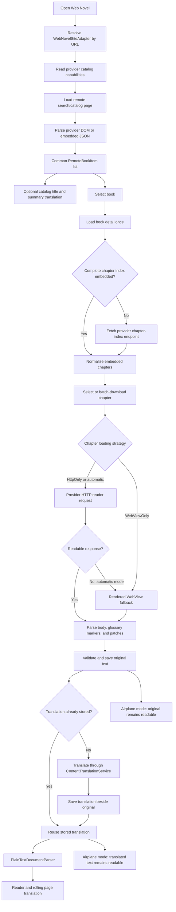

# Web Novel End-to-End Flow

This document describes the complete web-novel path from a remote catalog to an
airplane-mode translated chapter. Site adapters end at normalized original
content; translation, persistence, and reader rendering remain provider-neutral.

The latest deterministic and real-site verification is recorded in
[Web Novel Provider Test Report](WEB_NOVEL_TEST_REPORT.md).

## Runtime flow



## Pure Kotlin integration test

`WebNovelOfflineEndToEndTest` starts no Activity, Compose screen, Android
WebView, or real translation SDK. Network boundaries and the translation
provider are deterministic fixtures, while production adapters, parsers,
identity keys, translation cache, disk package format, and reader parser are
used unchanged.

```mermaid
sequenceDiagram
    participant Test
    participant Catalog as WebNovelRemoteBookSource
    participant Adapter as WtrLabSiteAdapter
    participant Translator as ContentTranslationService
    participant Store as OfflineNovelStorageStore
    participant Reader as PlainTextDocumentParser

    Test->>Catalog: Load catalog fixture
    Catalog->>Adapter: parseCatalogPage
    Adapter-->>Test: Common book item
    Test->>Translator: Translate catalog metadata
    Test->>Catalog: Load detail and chapter index
    Catalog->>Adapter: parseDetail and parseChapters
    Adapter-->>Test: Stable series and chapter identities
    Test->>Adapter: Load chapter in HttpOnly mode
    Adapter->>Adapter: Parse reader JSON and glossary markers
    Adapter-->>Test: Clean original paragraphs
    Test->>Reader: Parse original document
    Test->>Translator: Translate chapter body
    Test->>Translator: Repeat identical request
    Translator-->>Test: Cache hit; provider not called
    Test->>Store: Save original and Korean translation
    Test->>Store: Recreate store and load package
    Store-->>Test: Original and translation available offline
```

## Test commands

```bash
./gradlew :app:testDebugUnitTest \
  --tests 'com.dongholab.pagetuner.source.WebNovelOfflineEndToEndTest' \
  --tests 'com.dongholab.pagetuner.source.webnovel.WtrLabChapterLoadingTest'

RUN_LIVE_WEB_NOVEL_TESTS=1 ./gradlew :app:testDebugUnitTest \
  --tests 'com.dongholab.pagetuner.source.WtrLabFullFlowLiveTest' \
  --tests 'com.dongholab.pagetuner.source.NovelBuddyFullFlowLiveTest'
```

The WTR full live test performs three real website operations: server-side catalog
search, novel-detail HTML loading, and the chapter reader POST. It then saves
that real body as an original + translated offline package and verifies that
reopening the package performs no more web calls. The translation provider is
kept deterministic so this test diagnoses the web-novel pipeline instead of an
unrelated third-party translation outage.

The live test is opt-in because remote HTML, rate limits, and service
availability are outside the deterministic build boundary.

The NovelBuddy live test performs real server-side search, detail HTML, the
complete chapter-index API request, and chapter HTML extraction. It verifies
that a large work has every chapter and that detail/chapter URLs share one
series identity, without starting Android or WebView.

## Remaining improvements

| Priority | Work | Reason |
| --- | --- | --- |
| P0 | Add a shared repository with request single-flight, TTL/LRU caching, and conditional requests | Prevent duplicate crawling and stale unbounded page caches |
| P1 | Add typed HTTP outcomes for challenge, login, locked chapter, rate limit, and schema change | Decide accurately when WebView fallback is useful |
| P1 | Add per-host request pacing and bounded HTTP concurrency | HTTP chapters can be faster without overloading a source |
| P1 | Persist catalog pages and chapter indexes with provider-specific freshness | Make startup and book reopening immediate |
| P1 | Reuse or serialize the fallback WebView runtime | Avoid creating a new WebView for each fallback chapter |
| P2 | Provide a reusable provider contract-test suite and HTML/JSON fixture versioning | Adding the next web-novel provider becomes mechanical |
| P2 | Record fetch, parse, fallback, cache-hit, and translation timings | Distinguish network slowness from parsing or translation slowness |

The next structural milestone is a shared `WebNovelRepository`. Provider
capabilities are now implemented; the repository will centralize crawl
single-flight, cache freshness, and request pacing without changing E-Ink pages.
