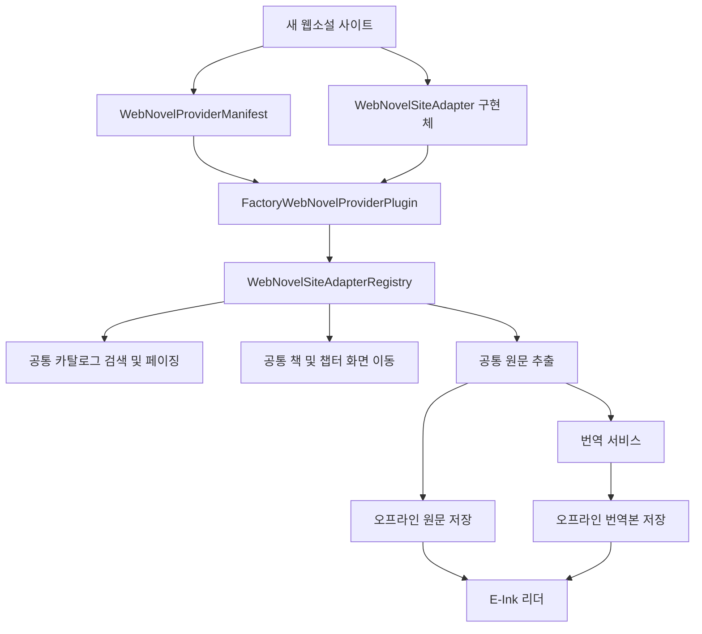
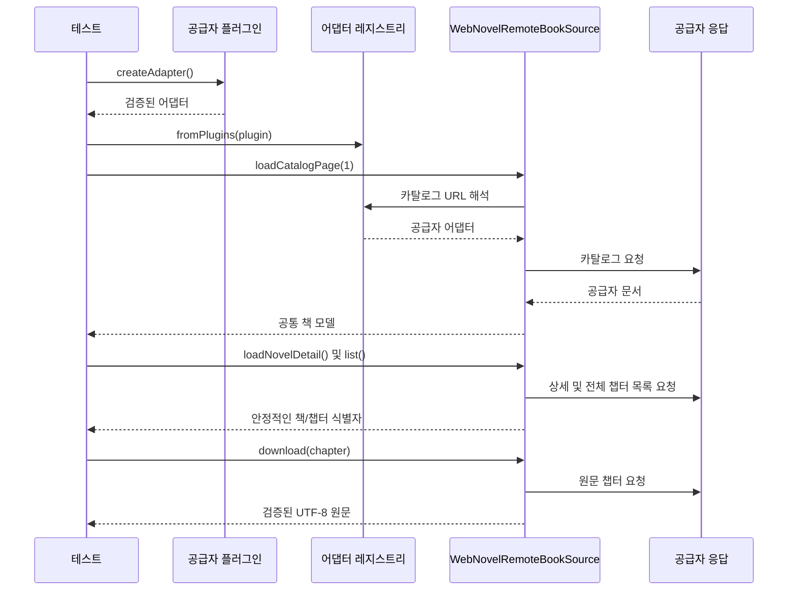
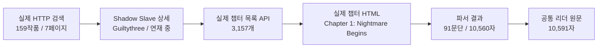

# 웹소설 공급자 플러그인

이 문서는 새로운 웹소설 사이트를 PageTurner에 추가하는 확장 경계를 정의합니다.
공급자 플러그인은 안정적인 메타데이터와 어댑터 생성기를 하나로 묶습니다. 따라서
새 사이트를 추가해도 카탈로그 UI, 화면 이동, 번역, 오프라인 저장, 리더에
사이트별 분기문을 추가할 필요가 없습니다.

## 요약

- 공급자 식별 정보, 기본 카탈로그 정보, 어댑터 생성을 검증 가능한 플러그인 하나로 묶었습니다.
- 기본 원격 소스 계정과 URL 소유권을 플러그인 매니페스트에서 파생하도록 변경했습니다.
- 새 샘플 사이트가 공통 전체 흐름을 통과하는지 검증하고, NovelBuddy는 실제 사이트를
  플러그인 레지스트리 경유로 다시 호출해 검증했습니다.

## 주요 파일

| 파일 | 역할 |
| --- | --- |
| `WebNovelProviderPlugin.kt` | 플러그인 매니페스트, 어댑터 생성기, 기본 공급자 목록 |
| `WebNovelSiteAdapter.kt` | 플러그인 기반 레지스트리 생성 및 런타임 등록 |
| `RemoteSourceAccountStore.kt` | 노출 가능한 매니페스트에서 기본 계정 생성 |
| `WebNovelProviderPluginFullFlowTest.kt` | 새 사이트에서 재사용할 전체 흐름 계약 테스트 |
| `NovelBuddyFullFlowLiveTest.kt` | NovelBuddy 플러그인을 통한 실제 원격 호출 테스트 |

## 플러그인 구성



`WebNovelProviderManifest`는 공급자 ID, 표시 이름, 안정적인 계정 ID, 선택적인
기본 카탈로그 URL을 관리합니다. `WebNovelProviderPlugin`은 어댑터를 생성하면서
매니페스트 ID와 어댑터 ID가 같은지 검증합니다. 기본 카탈로그 URL이 없는 공급자는
저장된 소스 계정에 노출되지 않고 fallback 전용으로 사용할 수 있습니다.

현재 기본 플러그인은 WTR-LAB, NovelBuddy, 범용 HTML fallback 순서로 설치됩니다.
기본 원격 소스 계정도 노출 가능한 플러그인 매니페스트에서 생성되므로, 새로운 기본
공급자를 추가할 때 `WebCatalogViewModel`에 호스트 이름 분기를 추가할 필요가 없습니다.

## 새 사이트 추가 방법

1. URL 분류, 카탈로그/상세/챕터 파싱, 검색 URL, 챕터 로딩을 담당하는
   `WebNovelSiteAdapter`를 구현합니다.
2. 고유 ID와 안정적인 계정 ID를 가진 `WebNovelProviderManifest`를 선언합니다.
3. 매니페스트와 어댑터를 `FactoryWebNovelProviderPlugin`으로 묶습니다.
4. 범용 HTML fallback보다 앞에 플러그인을 등록합니다.
5. 공통 플러그인 계약 테스트와 공급자별 실제 사이트 테스트를 실행합니다.

```kotlin
val myProvider = FactoryWebNovelProviderPlugin(
    manifest = WebNovelProviderManifest(
        id = "my-provider",
        displayName = "My Provider",
        accountId = "default_my_provider",
        defaultCatalogUrl = "https://novels.example/catalog",
    ),
    adapterFactory = ::MyProviderSiteAdapter,
)

val registry = WebNovelSiteAdapterRegistry.fromPlugins(
    listOf(myProvider, WebNovelProviderPlugins.genericHtml),
)
```

## 전체 흐름 계약 테스트

`WebNovelProviderPluginFullFlowTest`는 완전히 새로운 샘플 사이트를 플러그인 전용
레지스트리에 설치합니다. 이후 `WebNovelRemoteBookSource`를 수정하지 않은 채
`카탈로그 → 책 → 챕터 목록 → 원문 다운로드` 흐름을 실행합니다. 다음 실제 공급자를
추가할 때 복사해 사용할 수 있는 최소 계약 테스트입니다.



선택 실행 방식의 `NovelBuddyFullFlowLiveTest`도 NovelBuddy 플러그인으로 레지스트리를
구성합니다. 실제 키워드+장르 검색, 상세 파싱, 전체 원격 챕터 목록, WebView 없는
원문 추출을 검증합니다.

## 실제 사이트 검증 결과

아래 값은 `2026-08-15 19:02 PHT`에 NovelBuddy에서 직접 받은 응답입니다.
고정 fixture 값이 아닌 당시의 실측 결과이므로 카탈로그와 챕터 수는 이후 증가할 수 있습니다.

| 확인 항목 | 실제 원격 응답 |
| --- | --- |
| 검색 요청 | [`q=shadow slave`, `genres=fantasy`](https://novelbuddy.me/search?q=shadow%20slave&genres=fantasy) |
| 검색 카탈로그 | 작품 159개, 원격 7페이지 |
| 선택한 작품 | [`Shadow Slave`](https://novelbuddy.me/shadow-slave) |
| 파싱한 저자/상태 | `Guiltythree` / `ongoing` |
| 상세 화면의 챕터 수 | 3,157개 |
| 불러온 전체 챕터 목록 | 3,157개, 상세 화면의 수치와 일치 |
| 첫 번째 챕터 | [`Chapter 1: Nightmare Begins`](https://novelbuddy.me/shadow-slave/chapter-1-nightmare-begins) |
| 파싱한 원문 본문 | 91문단, 본문 10,560자 |
| 리더용 직렬화 결과 | Markdown 제목 포함 10,591자 |
| 렌더링 경로 | 실제 HTTP + Next.js JSON, `WebView=false` |



위 결과는 샘플 fixture 테스트가 아닙니다. 실제 사이트 테스트는 운영 코드의
`WebNovelHttpClient`, 플러그인 전용 어댑터 레지스트리,
`renderedChapterLoader = null`을 사용합니다. 따라서 fixture, 캐시된 렌더링 결과,
WebView fallback으로는 테스트가 통과할 수 없습니다.

테스트에서는 정확한 작품명과 저자, 2페이지 이상의 카탈로그, 3,000개 이상의 챕터,
상세/목록 챕터 수 일치, 첫 챕터 번호와 책 식별자, 5,000자 이상의 본문, 실제 등장인물명
`Sunny`까지 검증합니다.

또한 테스트 실행 시 JUnit 출력에 `LIVE_WEB_NOVEL_EVIDENCE` 블록을 남깁니다.
원격 카탈로그가 증가하더라도 검증 조건을 약화하지 않고 실행 시점의 실측값을 비교할 수 있습니다.

## 검증 결과

| 검사 항목 | 결과 |
| --- | --- |
| 플러그인 매니페스트/어댑터 일치 검증 | 통과 |
| 플러그인 전용 레지스트리 구성 | 통과 |
| 새 샘플 공급자 전체 흐름 계약 테스트(고정 fixture) | 통과 |
| 플러그인 매니페스트 기반 기본 계정 생성 | 통과 |
| 전체 Debug 단위 테스트 | 통과 |
| Debug Lint 및 APK 빌드 | 통과 |
| NovelBuddy 실제 플러그인 흐름(운영 HTTP, fixture/WebView 미사용) | 통과 |

```bash
./gradlew :app:testDebugUnitTest :app:lintDebug :app:assembleDebug

RUN_LIVE_WEB_NOVEL_TESTS=1 ./gradlew :app:testDebugUnitTest \
  --tests 'com.dongholab.pagetuner.source.NovelBuddyFullFlowLiveTest'
```

실제 사이트 테스트는 원격 서비스 상태, 요청 제한, DOM 변경처럼 빌드가 통제할 수 없는
요소가 있으므로 기본 테스트에서는 제외하고 환경 변수로 선택 실행합니다.
