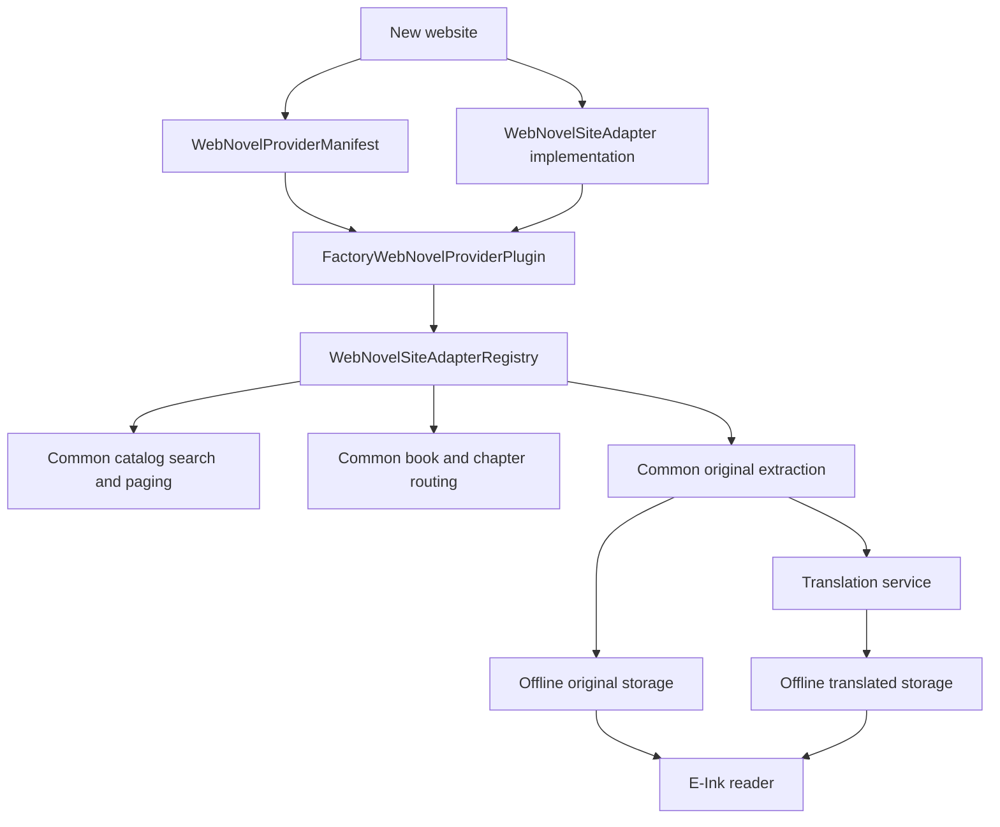
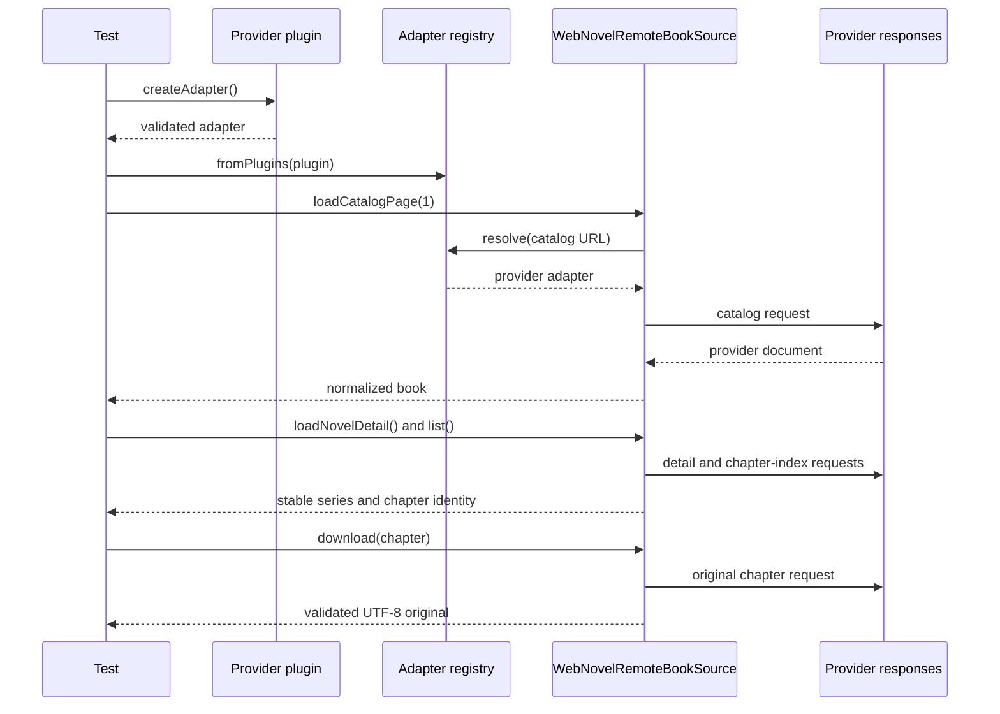

# Web Novel Provider Plugins

This document defines the installable boundary for adding another web-novel
website. A provider plugin packages stable metadata and an adapter factory;
catalog UI, routing, translation, offline storage, and the reader do not gain
provider-specific branches.

## Summary

- Package provider identity, default catalog metadata, and adapter creation as
  one validated plugin.
- Derive built-in source accounts and URL ownership from plugin manifests.
- Verify a newly installed sample website through the complete common flow and
  rerun NovelBuddy against the real website through its plugin registry.

## Main files

| File | Responsibility |
| --- | --- |
| `WebNovelProviderPlugin.kt` | Plugin manifest, adapter factory, and built-in provider list |
| `WebNovelSiteAdapter.kt` | Plugin-based registry construction and runtime registration |
| `RemoteSourceAccountStore.kt` | Default accounts derived from discoverable manifests |
| `WebNovelProviderPluginFullFlowTest.kt` | Reusable new-site end-to-end contract |
| `NovelBuddyFullFlowLiveTest.kt` | Actual remote flow resolved through the NovelBuddy plugin |

## Plugin composition



`WebNovelProviderManifest` owns the provider ID, display name, stable account
ID, and optional default catalog URL. `WebNovelProviderPlugin` creates the
adapter and validates that the manifest and adapter IDs agree. A provider with
no default catalog URL can remain a fallback without appearing as a saved
source account.

The built-in list currently installs WTR-LAB, NovelBuddy, and the generic HTML
fallback in that order. Default source accounts are derived from discoverable
plugin manifests, so adding a default provider no longer requires another
hostname branch in `WebCatalogViewModel`.

## Add another website

1. Implement `WebNovelSiteAdapter` for URL classification, catalog/detail/
   chapter parsing, search URLs, and chapter loading.
2. Declare one `WebNovelProviderManifest` with a unique ID and stable account
   ID.
3. Wrap both in `FactoryWebNovelProviderPlugin`.
4. Register the plugin before the generic fallback.
5. Run the reusable plugin contract and a provider-specific opt-in live test.

```kotlin
val myProvider = FactoryWebNovelProviderPlugin(
    manifest = WebNovelProviderManifest(
        id = "my-provider",
        displayName = "My Provider",
        accountId = "default_my_provider",
        defaultCatalogUrl = "https://novels.example/catalog",
    ),
    adapterFactory = ::MyProviderSiteAdapter,
)

val registry = WebNovelSiteAdapterRegistry.fromPlugins(
    listOf(myProvider, WebNovelProviderPlugins.genericHtml),
)
```

## Full-flow contract

`WebNovelProviderPluginFullFlowTest` installs a completely new sample website
through a plugin-only registry. It then runs catalog → book → chapter list →
original download using `WebNovelRemoteBookSource` unchanged. This is the
minimum contract test to copy for the next real provider.



The opt-in `NovelBuddyFullFlowLiveTest` also constructs its registry from the
NovelBuddy plugin. It verifies real keyword + genre search, detail parsing, the
complete remote chapter index, and original body extraction without WebView.

## Verification

| Check | Result |
| --- | --- |
| Plugin manifest/adapter validation | PASS |
| Plugin-only registry composition | PASS |
| New sample provider full-flow contract | PASS |
| Default accounts derived from manifests | PASS |
| Full debug unit suite | PASS |
| Debug lint and APK assembly | PASS |
| NovelBuddy real plugin flow | PASS |

```bash
./gradlew :app:testDebugUnitTest :app:lintDebug :app:assembleDebug

RUN_LIVE_WEB_NOVEL_TESTS=1 ./gradlew :app:testDebugUnitTest \
  --tests 'com.dongholab.pagetuner.source.NovelBuddyFullFlowLiveTest'
```

Remote live tests remain opt-in because provider availability, throttling, and
DOM changes are not deterministic build inputs.
