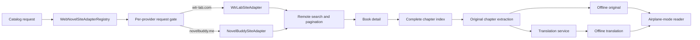
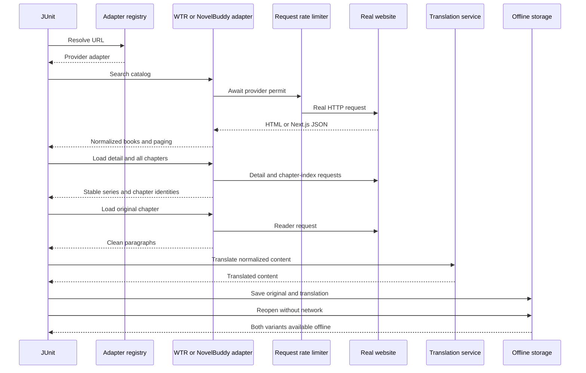

# Web Novel Provider Test Report

Tested on 2026-08-15. This report covers the shared web-novel provider
interface, WTR-LAB, NovelBuddy, offline original/translation persistence, and
the E-Ink page contracts. Live tests use real remote responses; deterministic
tests run without an Activity or WebView.

## Verified flow



## Results

| Layer | Scenario | Result |
| --- | --- | --- |
| Unit/integration | All debug unit tests | PASS |
| Static analysis | Android lint for debug | PASS |
| Build | Debug APK assembly | PASS |
| NovelBuddy live | Keyword + Fantasy search, detail, full chapter index, chapter body | PASS |
| WTR-LAB live | Finder search, detail, reader POST, offline reopen | PASS |
| Request pacing | Provider serialization, subdomain sharing, Retry-After/backoff | PASS |
| Formatting | `git diff --check` | PASS |

The NovelBuddy live flow resolved `Shadow Slave` from an actual remote search,
loaded its detail document, obtained the complete chapter index from the
provider endpoint, and extracted a readable first chapter without Android or
WebView. At test time the work exposed 3,160 chapters; the assertion deliberately
uses a lower bound so normal catalog growth does not break the build.

The WTR-LAB live flow exercised its actual finder, novel detail document, and
reader POST. It saved the extracted body as original and translated offline
content, reopened it, and verified that reopening required no further web
request. The translation provider in this network test is deterministic so a
third-party translator outage cannot obscure crawler regressions.

## Commands

```bash
./gradlew :app:testDebugUnitTest :app:lintDebug :app:assembleDebug

RUN_LIVE_WEB_NOVEL_TESTS=1 ./gradlew :app:testDebugUnitTest \
  --tests 'com.dongholab.pagetuner.source.NovelBuddyFullFlowLiveTest'

RUN_LIVE_WEB_NOVEL_TESTS=1 ./gradlew :app:testDebugUnitTest \
  --tests 'com.dongholab.pagetuner.source.WtrLabFullFlowLiveTest'
```

Live suites remain opt-in because remote availability, throttling, and DOM
changes are outside the deterministic build boundary. The current combined run
passed with centralized host pacing active: NovelBuddy completed in 6.714 s and
WTR-LAB completed in 5.398 s. Deterministic tests separately verify minimum
intervals, shared subdomain buckets, and `Retry-After` behavior without sleeping.

## Test boundary



## Regression coverage

- Provider selection and generic-fallback precedence
- Provider-owned catalog capabilities, keyword/genre parameters, and page URLs
- NovelBuddy embedded JSON parsing and complete chapter-index API parsing
- WTR reader response parsing and HTTP/WebView load-policy boundaries
- Per-provider pacing, asset/document buckets, Retry-After and exponential backoff
- Stable series identity across book and chapter URLs
- Duplicate chapter-title isolation
- Offline original/translation cache reuse
- E-Ink loading overlay, fixed paging slots, and viewport page preservation
