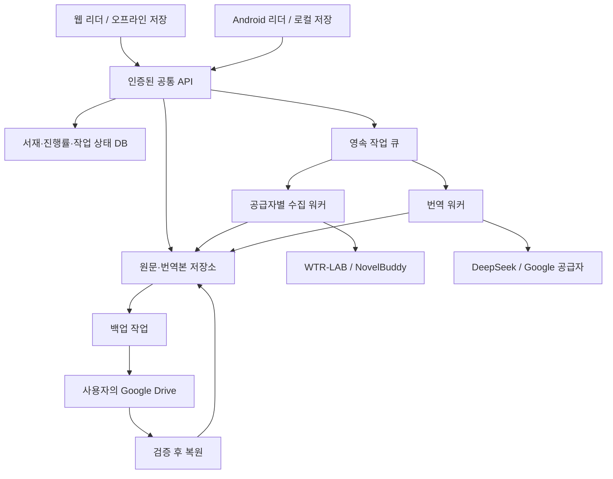
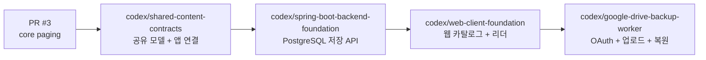
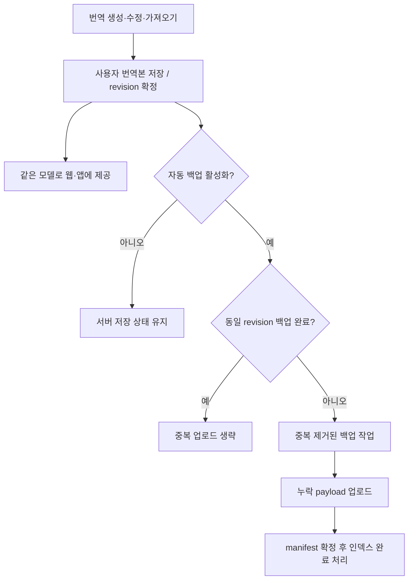

# 웹 서비스 전환 및 Google Drive 번역본 백업 계획

작성일: 2026-09-05. 상태: 공유 모델 추출 완료, 서버 초기 구성 작업 중.
웹 클라이언트와 Drive 자동 백업은 미구현입니다. 현재 구현 범위와 독립 빌드 명령은
[앱·백엔드·코어 분리](APP_SERVER_CORE_SEPARATION.md)를 기준으로 확인합니다.

## 목표와 현재 출발점

Android와 웹에서 같은 책·챕터·번역본·등장인물 사전·읽기 위치를 사용합니다.
서버가 수집과 번역 작업을 수행하고 결과를 저장하며, 사용자의 Google Drive에
번역본을 백업합니다. 비행기에서 읽을 내용은 출발 전에 기기에도 내려받습니다.

현재 `:core-model`은 순수 Kotlin 페이징 계약과 범위 계산을 제공합니다.
`WebCatalogPageService`는 Compose 없이 호출할 수 있지만 여전히 Android 앱
모듈에 있으며, `WebNovelRemoteBookSource`에는 Android 로깅 의존성이 남아 있습니다.
`TranslationCache`의 파일 구현 및 exporter에도 Context/Uri 의존성이 있습니다.
따라서 현재 앱 전체를 그대로 서버에 배포할 수 있는 상태는 아닙니다.

현재 `GoogleDriveTransport`는 목록 조회와 다운로드만 제공합니다.
`GoogleDriveAuthHelper`는 `drive.readonly`, `response_type=token`을 사용합니다.
서버 자동 백업을 위해 쓰기 권한과 장기 인증, 업로드·복원 기능을 별도로 구현해야 합니다.

## 서비스 구조

서버로 이전하면 기기의 파싱·번역 부하와 반복 호출을 줄일 수 있습니다.
최초 원격 수집과 번역 자체의 대기 시간은 남으므로, 저장된 결과 즉시 응답과
백그라운드 갱신이 핵심입니다. 서버 이전만으로 Compose 렌더링 지연이 해결되지는
않으며 Android 프레임 측정과 컴포넌트 최적화는 함께 진행합니다.

## 모듈 경계

| 모듈 | 책임 |
| --- | --- |
| `core-model` | 구현: 페이지 계약·범위 계산 |
| `core-content` | 구현: 책·챕터·문단·읽기 위치 모델 / 예정: 공급자·파싱·요청 간격 |
| `core-translation` | 구현: 번역 식별자·결과·revision / 예정: 공급자 실행·묶음 요청·사전 적용 |
| `core-backup` | 구현: 백업 식별자·상태·중복 판정 / 예정: manifest·복원·저장소 계약 |
| `server` (신규) | HTTP API, 인증, DB, 영속 작업 큐, Drive OAuth와 업로드 |
| `web` (신규) | 웹 서재·카탈로그·리더·백업 설정, 기기 오프라인 저장 |
| `app` | Android 화면, 실제 페이지 배치, 로컬 저장, 서버 API 구현체 |

## PR 및 브랜치 구성

각 PR은 바로 앞 브랜치를 base로 사용합니다. 공유 모듈 PR에는 Spring/Web UI 코드를
넣지 않고, 서버 PR은 공유 모델을 소비합니다. 웹 PR은 서버의 버전 API 스키마를
소비하며 콘텐츠 식별과 백업 판정을 다시 구현하지 않습니다.

Kotlin 코어의 직접 재사용을 위해 서버는 Kotlin/JVM을 우선 고려합니다.
웹은 버전이 있는 JSON API 계약을 소비합니다. 프레임워크 및 배포 환경 선정은
서버 구현 단계에서 확정하며, 이 문서는 특정 호스팅 서비스를 생성하지 않습니다.

### 웹과 앱의 모델 재사용

책·챕터·문단·번역본·사전·읽기 위치 모델을 공통 코어로 추출하고 Android와
서버가 함께 사용합니다. 서버는 이 모델을 버전이 있는 API DTO로 변환해 웹에
제공합니다. 웹 타입은 API 스키마에서 생성해 필드 누락과 타입 불일치를 검사합니다.
현재 JVM 모듈의 Kotlin 클래스를 브라우저가 직접 실행하는 방식은 아닙니다.
Compose/ViewModel/Context는 각 플랫폼 계층에 남깁니다.

서버가 번역한 결과뿐 아니라 앱에서 이미 번역한 결과와 사용자가 직접 수정한
번역도 동일한 TranslationArtifact로 가져옵니다. 업로드에는 책·챕터·문단 식별자,
원문 버전, 번역 설정, 본문, 기준 revision을 포함하고 서버가 사용자 소유권과
원문 매핑을 검증합니다. 같은 revision의 반복 업로드는 같은 결과를 반환하고,
서로 다른 기기의 수정 충돌은 별도 revision으로 보존합니다.

## 속도를 위한 요청 흐름

1. 저장된 카탈로그/번역이 있으면 즉시 응답합니다. 오래된 카탈로그는 갱신 작업만 예약합니다.
2. 없는 콘텐츠는 작업 ID와 함께 `202 Accepted`를 반환하고 진행 상태를 조회하게 합니다.
3. 같은 사용자·내용·언어·설정의 요청은 작업 키로 합쳐 중복 수집과 중복 과금을 방지합니다.
4. 수집은 공급자별 동시성과 요청 간격을 제한합니다. 워커가 여러 대여도 제한을 공유합니다.
5. 작업은 대기/실행/성공/실패/취소 상태와 재시도를 영속 저장합니다. 재시작 후 이어서 처리합니다.
6. 번역 저장 완료 후 백업 인덱스에서 동일 revision의 백업 여부를 확인합니다.
   미백업 또는 변경된 자료만 별도 작업을 예약합니다. Drive 장애가 읽기나 번역 저장을 막지 않습니다.

서버 저장 데이터에는 사용자 소유권을 적용합니다. 개인 사전·번역·Drive 토큰은 사용자별로
격리하고, 최초 버전에서는 서로 다른 사용자의 번역을 자동으로 공유하지 않습니다.
서버 수집 URL은 등록된 공급자와 허용 주소로 검증하고 리디렉션도 다시 검증합니다.

## 번역본 식별과 화면 페이지

영속 식별자는 `providerId / bookId / chapterId / sourceRevision / paragraphId`를
기준으로 합니다. 챕터 번호와 제목은 표시 정보로 두며 동일 제목 때문에 충돌하지 않게 합니다.
번역 변형에는 원문/대상 언어, 번역 공급자·모델·프롬프트 버전, 책 사전 버전을 포함합니다.

웹과 Android는 뷰포트와 글꼴이 달라서 같은 '5페이지'가 서로 다른 문단일 수 있습니다.
클라이언트는 현재 배치의 1–10페이지에 해당하는 문단 ID들을 요청하고, 5페이지에서는
11–20페이지 문단을 선행 요청합니다. 서버는 이미 저장된 문단을 재사용합니다.
25페이지 점프 시에도 21–30페이지에 매핑된 문단을 요청합니다.

읽기 위치도 챕터 ID + 문단 ID + 문단 내 오프셋으로 동기화하고 각 화면에서 페이지로
환산합니다. 기존 페이지 기반 캐시는 원문과 매핑을 확인할 수 있는 경우에만 이관하며,
매핑이 불명확한 번역본은 기존 레이아웃의 legacy snapshot으로 보존합니다.

## Google Drive 백업과 복원

### 저장된 번역 재사용 및 중복 백업 방지

번역 재사용과 백업 생략을 다음 기준으로 구분합니다.

| 상태 | 읽기/번역 | 백업 동작 |
| --- | --- | --- |
| 서버에 해당 번역이 있고 같은 revision이 Drive에도 백업됨 | 저장본 반환, 번역 호출 0회 | 업로드 생략 |
| 서버에 해당 번역만 저장됨 | 저장본 반환, 번역 호출 0회 | 자동 백업이 켜져 있으면 최초 백업 |
| Drive에만 해당 번역이 있음 | 복원·검증 후 반환, 번역 호출 0회 | 복원본의 동일 revision 재백업 생략 |
| 앱에만 번역이 있음 | 서버에 동기화한 뒤 다른 기기에 제공 | 동일 백업 존재 여부를 확인해 누락분만 업로드 |
| 번역본을 수정하거나 새 언어/사전 버전으로 번역함 | 새 revision 저장 | 변경분만 백업 |
| 같은 백업이 대기/실행 중임 | 저장본 반환 | 기존 작업 재사용 |

백업 단위의 키는 사용자 ID + 백업 대상 계정 ID + artifact ID + revision +
정규화된 payload의 SHA-256입니다. 본문과 복원에 필요한 메타데이터를 해시에
포함하고 조회 시각 등 임시 상태는 제외합니다. 같은 제목이나 챕터 번호만으로
백업 완료를 판정하지 않습니다. 재번역 결과가 달라지면 새 revision이 됩니다.

서버는 Drive file ID, payload 해시, manifest revision, 완료/검증 시각을 백업
인덱스에 저장합니다. 작업 키에 유일성 제약을 두고, 업로드 응답을 잃은 재시도는
원격 식별자를 조회한 후 재개합니다. payload 업로드와 manifest 확정이 모두
성공하기 전에는 백업 완료로 표시하지 않습니다.

페이지를 열 때마다 Drive를 조회하지 않고 서버 인덱스로 중복 업로드를 막습니다.
사용자가 Drive에서 파일을 삭제할 수 있으므로 별도 백업 점검에서 실제 존재와
revision을 확인하고, 누락 발견 시 상태를 갱신해 자동 백업 설정에 따라 재백업합니다.
Drive 연결이 해제된 경우에는 읽기를 계속 제공하고 백업 상태를 미연결로 표시합니다.

읽기용 서버 저장소와 기기 캐시를 유지하고, Drive에 사용자별 복구 가능한 사본을 둡니다.
사용자가 Drive에서도 파일을 확인할 수 있도록 앱이 생성하는 `PageTurner Backups`
폴더와 `drive.file` 권한을 기본안으로 사용합니다. 이 권한은 앱이 생성하거나 사용자가
앱에 허용한 파일에 대한 접근을 제공합니다.
[Google Drive 권한 문서](https://developers.google.com/workspace/drive/api/guides/api-specific-auth)

Google 연결은 서버 Authorization Code 흐름으로 구현합니다. 로그인 세션과 연결되는
state 검증, 등록된 redirect URI, offline access 및 refresh token의 암호화 저장을
포함합니다. 클라이언트에 refresh token이나 번역 서비스 키를 전달하지 않습니다.
[Google 서버 OAuth 문서](https://developers.google.com/identity/protocols/oauth2/web-server)

백업 구성은 다음과 같습니다.

- 버전별 manifest: 스키마 버전, 책/챕터 식별자, 언어, 원문 해시, 파일 ID, 체크섬
- 챕터별 원문(사용자 선택)과 언어별 번역 문단
- 책별 등장인물 사전과 사전 버전
- 읽기 위치·책갈피와 변경 시각
- 사람이 읽을 수 있는 TXT/EPUB 내보내기는 구조화된 복원 자료와 별도 제공

변경된 챕터만 업로드하고 검증 후 새 manifest를 확정합니다. 업로드 중단 시 기존
백업 버전은 유지합니다. 이름이 같아도 Drive 파일은 여러 개 존재할 수 있으므로
논리 백업 ID와 Drive file ID 매핑을 저장해 재시도 시 중복 파일 생성을 방지합니다.
큰 자료에는 resumable upload를 사용합니다.
[Google 업로드 문서](https://developers.google.com/workspace/drive/api/guides/manage-uploads)

복원은 manifest 스키마와 체크섬을 검증한 임시 영역에서 진행하고 완료 후 적용합니다.
최신 로컬 사전/번역을 자동으로 덮어쓰지 않도록 충돌 버전을 보존합니다. 업로드 성공과
복원 가능 검증을 구분해 상태에 표시합니다. 연결 해제 시 후속 백업을 중단합니다.

## 비행기 모드

Drive에 백업되어 있는 것과 현재 기기에 저장되어 있는 것은 다릅니다. 서재에
`서버 저장됨 / Drive 백업됨 / 이 기기에서 오프라인 사용 가능`을 별도로 표시합니다.
웹은 선택한 책을 IndexedDB 등에 저장하고 앱 셸을 오프라인으로 준비합니다.
브라우저 저장소 삭제·용량 제한을 고려해 다운로드 결과와 누락 챕터를 확인합니다.
Android는 기존 로컬 저장소에 같은 문단 데이터와 사전을 저장합니다.

## 구현 순서와 완료 조건

1. 코어 추출: Android SDK 없이 공급자/번역/백업 모델 테스트와 서버 빌드 가능.
2. 서버 API: 한 공급자의 카탈로그 → 책 → 챕터 → 번역 → 재조회까지 실제 데이터로 통과.
3. 웹 리더: 공통 API로 탐색·읽기·진행률 저장. Android도 동일 계정 데이터를 조회.
4. Drive 연결: 사용자의 테스트 계정에서 업로드 → 내려받기 → 체크섬 검증 → 복원 통과.
5. 오프라인: 네트워크 차단 후 다운로드한 책/번역/사전을 열고 읽기 위치를 재동기화.
6. 성능: 최초 조회와 캐시 조회의 P50/P95, 중복 번역 요청 수, 화면 프레임을 각각 측정.

필수 회귀 시나리오는 원문 변경, 사전 변경, 다른 기기의 재페이지화, 작업 도중 서버
재시작, Drive 토큰 만료/연결 해제, 백업 업로드 중단, 사용자 간 데이터 접근 차단입니다.

중복 방지는 동일 번역 재열기 시 번역/업로드 모두 0회, 최초 백업 1회, 동시 백업
요청 병합, 수정본만 추가 백업, Drive 복원 직후 재업로드 0회로 검증합니다.
서버에만 저장된 최초 번역이 백업 대상으로 남는지도 확인합니다.

현재는 코드 및 Google 공식 문서를 확인해 설계만 기록했습니다. 이 설계에 대한 서버
실행·Drive 업로드·복원 테스트는 아직 하지 않았습니다. 실제 Drive 연결 단계에서는
Google Cloud OAuth 클라이언트 설정과 사용자의 계정 연결이 필요합니다.
